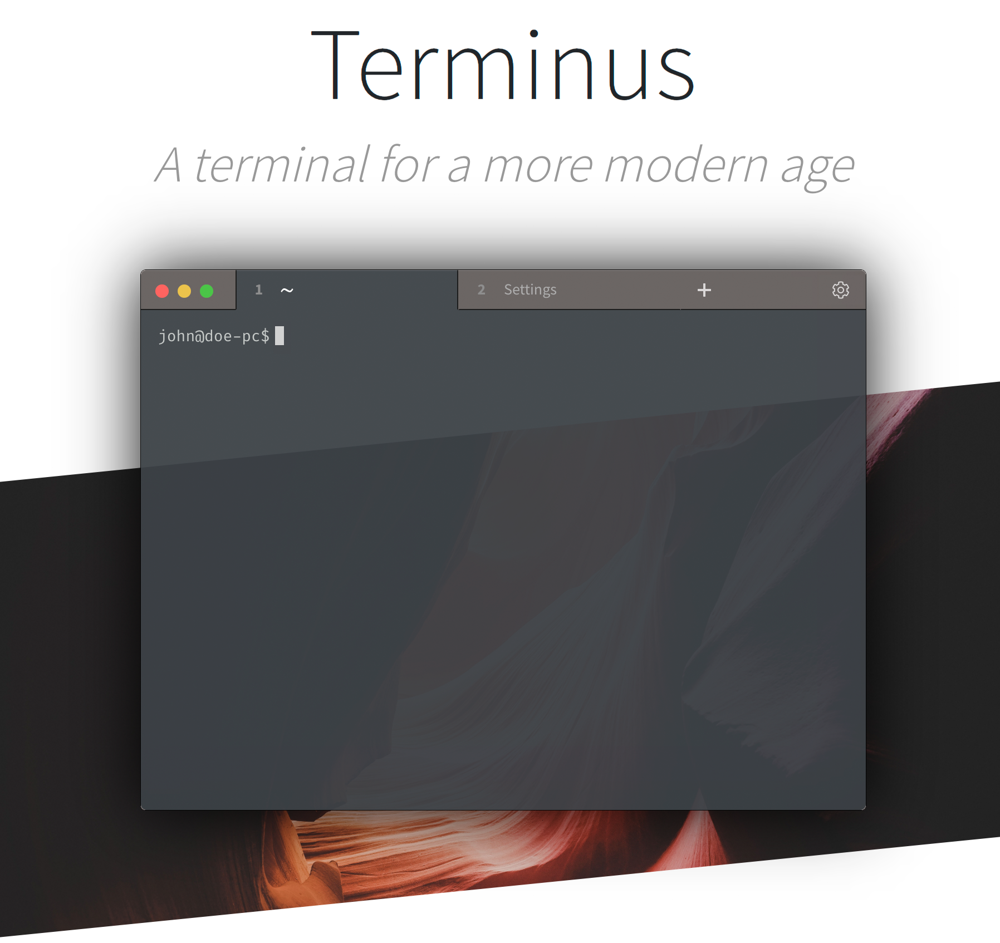
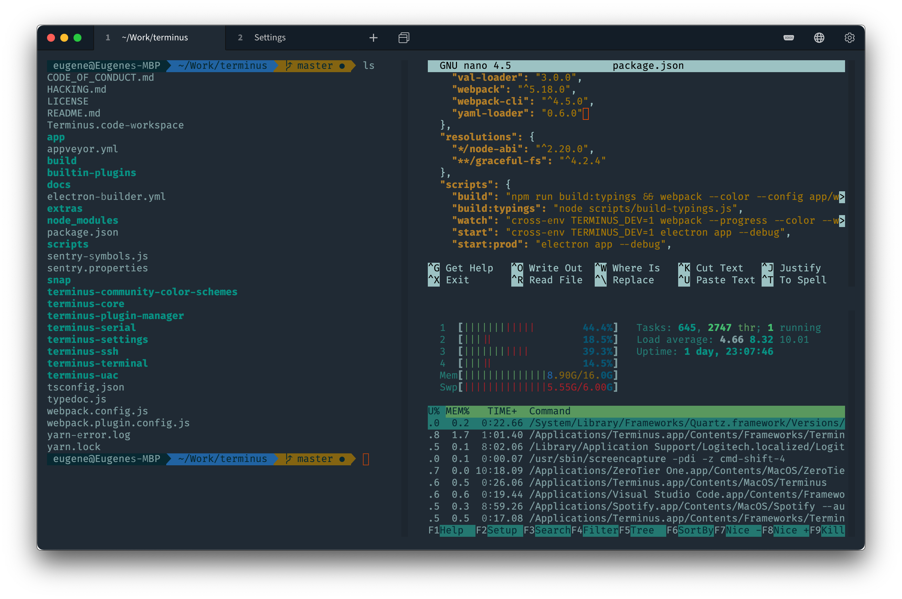

   &nbsp;  &nbsp; 

  

----

### 다운로드:

* [Latest release](https://github.com/Eugeny/tabby/releases/latest)
* [Repositories](https://packagecloud.io/eugeny/tabby): [Debian/Ubuntu-based](https://packagecloud.io/eugeny/tabby/install#bash-deb), [RPM-based](https://packagecloud.io/eugeny/tabby/install#bash-rpm)
* [Latest nightly build](https://nightly.link/Eugeny/tabby/workflows/build/master)

----

**Tabby** (구 **Terminus**)는 Windows, macOS 및 Linux용으로 뛰어난 구성의 터미널 에뮬레이터, SSH 및 시리얼 클라이언트입니다.

* 통합 SSH 클라이언트 및 연결 관리자
* 통합 시리얼 터미널
* 테마 및 색 구성표
* 전체 구성이 가능한 단축키 및 다중 코드 단축키
* 창 분할
* 이전 탭 사용을 기억
* PowerShell (및 PS Core), WSL, Git-Bash, Cygwin, Cmder 및 CMD 지원
* Zmodem을 통한 SSH 세션 간의 직접 파일 전송
* 2바이트 문자를 포함한 전체 유니코드 지원
* 빠르게 출력되는 것에 대해 휩쓸리지 않음
* 탭 완성을 포함한 Windows에서의 적절한 셸 환경 (Clink을 통해)
* SSH 시크릿 및 구성을 위한 통합 암호화 컨테이너

# 목차 <!-- omit in toc -->

- [Tabby는 무엇인가](#tabby는-무엇인가)
- [터미널 기능](#터미널-기능)
- [SSH 클라이언트](#ssh-클라이언트)
- [시리얼 터미널](#시리얼-터미널)
- [포터블](#포터블)
- [플러그인](#플러그인)
- [테마](#테마)
- [기여](#기여)

# Tabby는 무엇인가

* **Tabby는** Windows의 표준 터미널 (conhost), PowerShell ISE, PuTTY 또는 iTerm의 대안 프로그램입니다.

* **Tabby는** 새로운 셸이나 MinGW 또는 Cygwin을 대체하지 **않습니다**. 가볍지도 않습니다. - RAM 사용량이 중요한 경우, [Conemu](https://conemu.github.io) 또는 [Alacritty](https://github.com/jwilm/alacritty)를 고려하십시오.

# 터미널 기능

* A V220 터미널 + 다양한 확장
* 여러 개의 분할 창 중첩
* 모든 측면에 탭이 위치함
* 전역 스폰 단축키가 있는 도킹 가능한 윈도우 ("Quake console")
* 진행률 탐지
* 프로세스 완료 시 알림
* 괄호 붙여넣기, 여러 줄 붙여넣기 경고
* 폰트 합자(ligatures)
* 커스텀 셸 프로필
* RMB 붙여넣기 및 복사 선택 옵션 (PuTTY 스타일)

# SSH 클라이언트

* 연결 관리자가 있는 SSH2 클라이언트
* X11 및 포트 포워딩
* 자동 jump 호스트 관리
* 에이전트 전달 (Pageant 및 Windows 기본 OpenSSH 에이전트 포함)
* 로그인 스크립트

# 시리얼 터미널

* 연결 저장
* Readline 입력 지원
* 선택적 hex byte별 입력 및 hexdump 출력
* 개행 변환
* 자동 재접속

# 포터블

`Tabby.exe`가 있는 동일한 위치에 `data` 폴더를 생성하면 Windows에서 Tabby가 포터블 앱으로 실행됩니다.

# 플러그인

플러그인과 테마는 Tabby 내부의 설정에서 직접 설치할 수 있습니다.

* [clickable-links](https://github.com/Eugeny/tabby-clickable-links) - m터미널의 경로 및 URL을 클릭 가능하게
* [docker](https://github.com/Eugeny/tabby-docker) - Docker 컨테이너에 연결
* [title-control](https://github.com/kbjr/terminus-title-control) - 접두사, 접미사 및/또는 문자열 제거를 제공하여 터미널 탭의 제목을 수정
* [quick-cmds](https://github.com/Domain/terminus-quick-cmds) - 하나 또는 모든 터미널 탭에 신속한 명령 전송
* [save-output](https://github.com/Eugeny/tabby-save-output) - 터미널 출력을 파일에 기록
* [sync-config](https://github.com/starxg/terminus-sync-config) - 구성을 Gist 또는 Gitee에 동기화
* [clippy](https://github.com/Eugeny/tabby-clippy) - 항상 당신을 귀찮게 하는 예제 플러그인

# 테마

* [hype](https://github.com/Eugeny/tabby-theme-hype) - Hyper에서 영감을 받은 테마
* [relaxed](https://github.com/Relaxed-Theme/relaxed-terminal-themes#terminus) - Tabby를 위해 여유로움을 제공하는 테마
* [gruvbox](https://github.com/porkloin/terminus-theme-gruvbox)
* [windows10](https://www.npmjs.com/package/terminus-theme-windows10)
* [altair](https://github.com/yxuko/terminus-altair)

# 스폰서 <!-- omit in toc -->

[**packagecloud**](https://packagecloud.io)가 무료 Debian/RPM 저장소 호스팅을 제공하였습니다.

# 기여

Pull requests and plugins are welcome!

프로젝트 배치 방법에 대한 자세한 내용과 매우 간단한 플러그인 개발 튜토리얼은 [HACKING.md](https://github.com/Eugeny/tabby/blob/master/HACKING.md) 및 [API docs](https://docs.tabby.sh/)를 참조하십시오.

---

여기있는 멋진 사람들에게 진심으로 감사합니다. ([emoji key](https://allcontributors.org/docs/en/emoji-key)):

<!-- ALL-CONTRIBUTORS-LIST:START - Do not remove or modify this section -->
<!-- prettier-ignore-start -->
<!-- markdownlint-disable -->
<table>
  <tr>
    <td align="center"><a href="http://www.russellmyers.com"> <b>Russell Myers</b></a> <a href="https://github.com/Eugeny/tabby/commits?author=mezner" title="Code">💻</a></td>
    <td align="center"><a href="http://www.morwire.com"> <b>Austin Warren</b></a> <a href="https://github.com/Eugeny/tabby/commits?author=ehwarren" title="Code">💻</a></td>
    <td align="center"><a href="https://github.com/Drachenkaetzchen"> <b>Felicia Hummel</b></a> <a href="https://github.com/Eugeny/tabby/commits?author=Drachenkaetzchen" title="Code">💻</a></td>
    <td align="center"><a href="https://github.com/mikemaccana"> <b>Mike MacCana</b></a> <a href="https://github.com/Eugeny/tabby/commits?author=mikemaccana" title="Tests">⚠️</a> <a href="#design-mikemaccana" title="Design">🎨</a></td>
    <td align="center"><a href="https://github.com/yxuko"> <b>Yacine Kanzari</b></a> <a href="https://github.com/Eugeny/tabby/commits?author=yxuko" title="Code">💻</a></td>
    <td align="center"><a href="https://github.com/BBJip"> <b>BBJip</b></a> <a href="https://github.com/Eugeny/tabby/commits?author=BBJip" title="Code">💻</a></td>
    <td align="center"><a href="https://github.com/Futagirl"> <b>Futagirl</b></a> <a href="#design-Futagirl" title="Design">🎨</a></td>
  </tr>
  <tr>
    <td align="center"><a href="https://www.levrik.io"> <b>Levin Rickert</b></a> <a href="https://github.com/Eugeny/tabby/commits?author=levrik" title="Code">💻</a></td>
    <td align="center"><a href="https://kwonoj.github.io"> <b>OJ Kwon</b></a> <a href="https://github.com/Eugeny/tabby/commits?author=kwonoj" title="Code">💻</a></td>
    <td align="center"><a href="https://github.com/Domain"> <b>domain</b></a> <a href="#plugin-Domain" title="Plugin/utility libraries">🔌</a> <a href="https://github.com/Eugeny/tabby/commits?author=Domain" title="Code">💻</a></td>
    <td align="center"><a href="http://www.jbrumond.me"> <b>James Brumond</b></a> <a href="#plugin-kbjr" title="Plugin/utility libraries">🔌</a></td>
    <td align="center"><a href="http://www.growingwiththeweb.com"> <b>Daniel Imms</b></a> <a href="https://github.com/Eugeny/tabby/commits?author=Tyriar" title="Code">💻</a> <a href="#plugin-Tyriar" title="Plugin/utility libraries">🔌</a> <a href="https://github.com/Eugeny/tabby/commits?author=Tyriar" title="Tests">⚠️</a></td>
    <td align="center"><a href="https://github.com/baflo"> <b>Florian Bachmann</b></a> <a href="https://github.com/Eugeny/tabby/commits?author=baflo" title="Code">💻</a></td>
    <td align="center"><a href="http://michael-kuehnel.de"> <b>Michael Kühnel</b></a> <a href="https://github.com/Eugeny/tabby/commits?author=mischah" title="Code">💻</a> <a href="#design-mischah" title="Design">🎨</a></td>
  </tr>
  <tr>
    <td align="center"><a href="https://github.com/NieLeben"> <b>Tilmann Meyer</b></a> <a href="https://github.com/Eugeny/tabby/commits?author=NieLeben" title="Code">💻</a></td>
    <td align="center"><a href="http://www.jubeat.net"> <b>PM Extra</b></a> <a href="https://github.com/Eugeny/tabby/issues?q=author%3APMExtra" title="Bug reports">🐛</a></td>
    <td align="center"><a href="https://jjuhas.keybase.pub//"> <b>Jonathan</b></a> <a href="https://github.com/Eugeny/tabby/commits?author=IgnusG" title="Code">💻</a></td>
    <td align="center"><a href="https://hans-koch.me"> <b>Hans Koch</b></a> <a href="https://github.com/Eugeny/tabby/commits?author=hammster" title="Code">💻</a></td>
    <td align="center"><a href="http://thepuzzlemaker.info"> <b>Dak Smyth</b></a> <a href="https://github.com/Eugeny/tabby/commits?author=ThePuzzlemaker" title="Code">💻</a></td>
    <td align="center"><a href="http://yfwz100.github.io"> <b>Wang Zhi</b></a> <a href="https://github.com/Eugeny/tabby/commits?author=yfwz100" title="Code">💻</a></td>
    <td align="center"><a href="https://github.com/jack1142"> <b>jack1142</b></a> <a href="https://github.com/Eugeny/tabby/commits?author=jack1142" title="Code">💻</a></td>
  </tr>
  <tr>
    <td align="center"><a href="https://github.com/hdougie"> <b>Howie Douglas</b></a> <a href="https://github.com/Eugeny/tabby/commits?author=hdougie" title="Code">💻</a></td>
    <td align="center"><a href="https://chriskaczor.com"> <b>Chris Kaczor</b></a> <a href="https://github.com/Eugeny/tabby/commits?author=ckaczor" title="Code">💻</a></td>
    <td align="center"><a href="https://www.boxmein.net"> <b>Johannes Kadak</b></a> <a href="https://github.com/Eugeny/tabby/commits?author=boxmein" title="Code">💻</a></td>
    <td align="center"><a href="https://github.com/LeSeulArtichaut"> <b>LeSeulArtichaut</b></a> <a href="https://github.com/Eugeny/tabby/commits?author=LeSeulArtichaut" title="Code">💻</a></td>
    <td align="center"><a href="https://github.com/CyrilTaylor"> <b>Cyril Taylor</b></a> <a href="https://github.com/Eugeny/tabby/commits?author=CyrilTaylor" title="Code">💻</a></td>
    <td align="center"><a href="https://github.com/nstefanou"> <b>nstefanou</b></a> <a href="https://github.com/Eugeny/tabby/commits?author=nstefanou" title="Code">💻</a> <a href="#plugin-nstefanou" title="Plugin/utility libraries">🔌</a></td>
    <td align="center"><a href="https://github.com/orin220444"> <b>orin220444</b></a> <a href="https://github.com/Eugeny/tabby/commits?author=orin220444" title="Code">💻</a></td>
  </tr>
  <tr>
    <td align="center"><a href="https://github.com/Goobles"> <b>Gobius Dolhain</b></a> <a href="https://github.com/Eugeny/tabby/commits?author=Goobles" title="Code">💻</a></td>
    <td align="center"><a href="https://github.com/3l0w"> <b>Gwilherm Folliot</b></a> <a href="https://github.com/Eugeny/tabby/commits?author=3l0w" title="Code">💻</a></td>
    <td align="center"><a href="https://github.com/Dimitory"> <b>Dmitry Pronin</b></a> <a href="https://github.com/Eugeny/tabby/commits?author=dimitory" title="Code">💻</a></td>
    <td align="center"><a href="https://github.com/JonathanBeverley"> <b>Jonathan Beverley</b></a> <a href="https://github.com/Eugeny/tabby/commits?author=JonathanBeverley" title="Code">💻</a></td>
    <td align="center"><a href="https://github.com/zend"> <b>Zenghai Liang</b></a> <a href="https://github.com/Eugeny/tabby/commits?author=zend" title="Code">💻</a></td>
    <td align="center"><a href="https://about.me/matishadow"> <b>Mateusz Tracz</b></a> <a href="https://github.com/Eugeny/tabby/commits?author=matishadow" title="Code">💻</a></td>
    <td align="center"><a href="https://zergpool.com"> <b>pinpin</b></a> <a href="https://github.com/Eugeny/tabby/commits?author=pinpins" title="Code">💻</a></td>
  </tr>
  <tr>
    <td align="center"><a href="https://github.com/TakuroOnoda"> <b>Takuro Onoda</b></a> <a href="https://github.com/Eugeny/tabby/commits?author=TakuroOnoda" title="Code">💻</a></td>
    <td align="center"><a href="https://github.com/frauhottelmann"> <b>frauhottelmann</b></a> <a href="https://github.com/Eugeny/tabby/commits?author=frauhottelmann" title="Code">💻</a></td>
    <td align="center"><a href="http://patalong.pl"> <b>Piotr Patalong</b></a> <a href="#design-VectorKappa" title="Design">🎨</a></td>
    <td align="center"><a href="https://github.com/clarkwang"> <b>Clark Wang</b></a> <a href="https://github.com/Eugeny/tabby/commits?author=clarkwang" title="Code">💻</a></td>
    <td align="center"><a href="https://github.com/iamchating"> <b>iamchating</b></a> <a href="https://github.com/Eugeny/tabby/commits?author=iamchating" title="Code">💻</a></td>
    <td align="center"><a href="https://github.com/starxg"> <b>starxg</b></a> <a href="#plugin-starxg" title="Plugin/utility libraries">🔌</a></td>
    <td align="center"><a href="http://hashnote.net/"> <b>Alisue</b></a> <a href="#design-lambdalisue" title="Design">🎨</a></td>
  </tr>
  <tr>
    <td align="center"><a href="https://github.com/ydcool"> <b>Dominic Yin</b></a> <a href="https://github.com/Eugeny/tabby/commits?author=ydcool" title="Code">💻</a></td>
    <td align="center"><a href="https://github.com/bdr99"> <b>Brandon Rothweiler</b></a> <a href="#design-bdr99" title="Design">🎨</a></td>
    <td align="center"><a href="https://git.io/JnP49"> <b>Logic Machine</b></a> <a href="https://github.com/Eugeny/tabby/commits?author=logicmachine123" title="Documentation">📖</a></td>
    <td align="center"><a href="https://github.com/cypherbits"> <b>cypherbits</b></a> <a href="https://github.com/Eugeny/tabby/commits?author=cypherbits" title="Documentation">📖</a></td>
    <td align="center"><a href="https://modulolotus.net"> <b>Matthew Davidson</b></a> <a href="https://github.com/Eugeny/tabby/commits?author=KingMob" title="Code">💻</a></td>
    <td align="center"><a href="https://github.com/al-wi"> <b>Alexander Wiedemann</b></a> <a href="https://github.com/Eugeny/tabby/commits?author=al-wi" title="Code">💻</a></td>
  </tr>
</table>

<!-- markdownlint-restore -->
<!-- prettier-ignore-end -->

<!-- ALL-CONTRIBUTORS-LIST:END -->

이 프로젝트는 [모든 기여자](https://github.com/all-contributors/all-contributors)의 규격을 따릅니다. 어떠한 종류의 기여도 모두 환영합니다!

