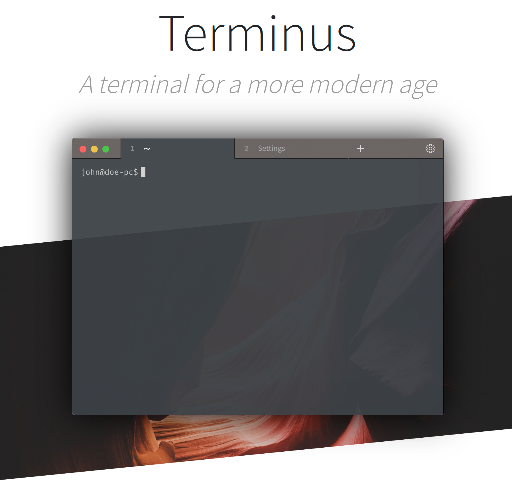
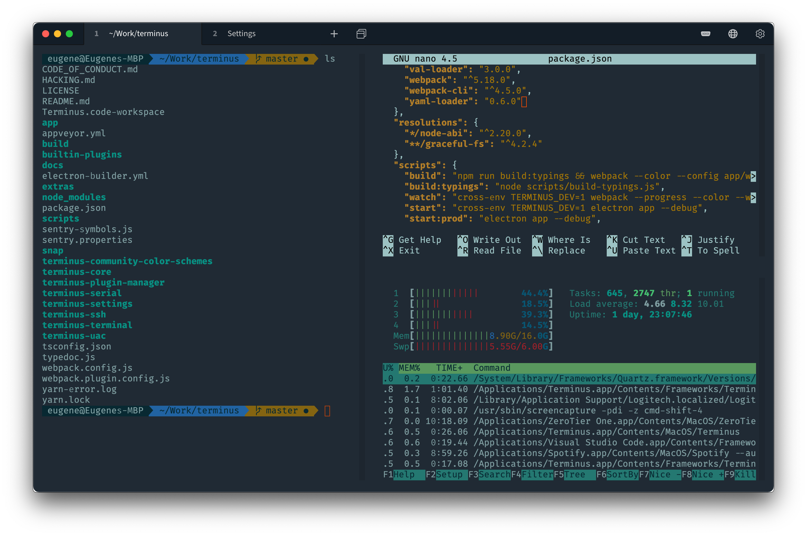
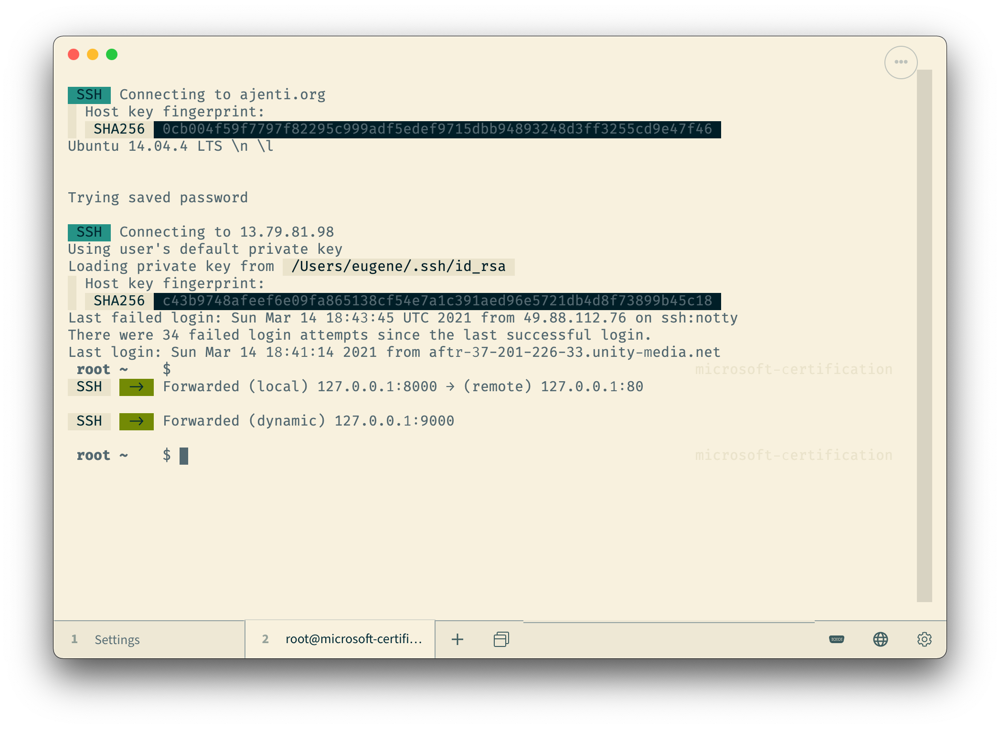

   &nbsp;  &nbsp; 

  

----

### 다운로드:

* [Latest release](https://github.com/Eugeny/tabby/releases/latest)
* [Repositories](https://packagecloud.io/eugeny/tabby): [Debian/Ubuntu-based](https://packagecloud.io/eugeny/tabby/install#bash-deb), [RPM-based](https://packagecloud.io/eugeny/tabby/install#bash-rpm)
* [Latest nightly build](https://nightly.link/Eugeny/tabby/workflows/build/master)

 

This README is also available in: <a  href="./README.md">:gb: English</a> · <a  href="./README.es-ES.md">:es: Spanish</a> · <a  href="./README.ru-RU.md">:ru: Русский</a> · <a  href="./README.zh-CN.md">:cn: 简体中文</a> · <a  href="./README.it-IT.md">:it: Italiano</a> · <a href="./README.de-DE.md">:de: Deutsch</a> · <a href="./README.ja-JP.md">:jp: 日本語</a> · <a href="./README.id-ID.md">:id: Bahasa Indonesia</a> · <a href="./README.pt-BR.md">:brazil: Português</a> · <a href="./README.pl-PL.md">:poland: Polski</a>

----

**Tabby** (구 **Terminus**)는 Windows, macOS 및 Linux용으로 뛰어난 구성의 터미널 에뮬레이터, SSH 및 시리얼 클라이언트입니다.

* 통합 SSH 클라이언트 및 연결 관리자
* 통합 시리얼 터미널
* 테마 및 색 구성표
* 전체 구성이 가능한 단축키 및 다중 코드 단축키
* 창 분할
* 이전 탭 사용을 기억
* PowerShell (및 PS Core), WSL, Git-Bash, Cygwin, Cmder 및 CMD 지원
* Zmodem을 통한 SSH 세션 간의 직접 파일 전송
* 2바이트 문자를 포함한 전체 유니코드 지원
* 빠르게 출력되는 것에 대해 휩쓸리지 않음
* 탭 완성을 포함한 Windows에서의 적절한 셸 환경 (Clink을 통해)
* SSH 시크릿 및 구성을 위한 통합 암호화 컨테이너

# 목차 <!-- omit in toc -->

- [Tabby는 무엇인가](#tabby는-무엇인가)
- [터미널 기능](#터미널-기능)
- [SSH 클라이언트](#ssh-클라이언트)
- [시리얼 터미널](#시리얼-터미널)
- [포터블](#포터블)
- [플러그인](#플러그인)
- [테마](#테마)
- [기여](#기여)

# Tabby는 무엇인가

* **Tabby는** Windows의 표준 터미널 (conhost), PowerShell ISE, PuTTY 또는 iTerm의 대안 프로그램입니다.

* **Tabby는** 새로운 셸이나 MinGW 또는 Cygwin을 대체하지 **않습니다**. 가볍지도 않습니다. - RAM 사용량이 중요한 경우, [Conemu](https://conemu.github.io) 또는 [Alacritty](https://github.com/jwilm/alacritty)를 고려하십시오.

# 터미널 기능

* A VT220 터미널 + 다양한 확장
* 여러 개의 분할 창 중첩
* 모든 측면에 탭이 위치함
* 전역 스폰 단축키가 있는 도킹 가능한 윈도우 ("Quake console")
* 진행률 탐지
* 프로세스 완료 시 알림
* 괄호 붙여넣기, 여러 줄 붙여넣기 경고
* 폰트 합자(ligatures)
* 커스텀 셸 프로필
* RMB 붙여넣기 및 복사 선택 옵션 (PuTTY 스타일)

# SSH 클라이언트

* 연결 관리자가 있는 SSH2 클라이언트
* X11 및 포트 포워딩
* 자동 jump 호스트 관리
* 에이전트 전달 (Pageant 및 Windows 기본 OpenSSH 에이전트 포함)
* 로그인 스크립트

# 시리얼 터미널

* 연결 저장
* Readline 입력 지원
* 선택적 hex byte별 입력 및 hexdump 출력
* 개행 변환
* 자동 재접속

# 포터블

`Tabby.exe`가 있는 동일한 위치에 `data` 폴더를 생성하면 Windows에서 Tabby가 포터블 앱으로 실행됩니다.

# 플러그인

플러그인과 테마는 Tabby 내부의 설정에서 직접 설치할 수 있습니다.

* [clickable-links](https://github.com/Eugeny/tabby-clickable-links) - 터미널의 경로 및 URL을 클릭 가능하게
* [docker](https://github.com/Eugeny/tabby-docker) - Docker 컨테이너에 연결
* [title-control](https://github.com/kbjr/terminus-title-control) - 접두사, 접미사 및/또는 문자열 제거를 제공하여 터미널 탭의 제목을 수정
* [quick-cmds](https://github.com/Domain/terminus-quick-cmds) - 하나 또는 모든 터미널 탭에 신속한 명령 전송
* [save-output](https://github.com/Eugeny/tabby-save-output) - 터미널 출력을 파일에 기록
* [sync-config](https://github.com/starxg/terminus-sync-config) - 구성을 Gist 또는 Gitee에 동기화
* [clippy](https://github.com/Eugeny/tabby-clippy) - 항상 당신을 귀찮게 하는 예제 플러그인
* [workspace-manager](https://github.com/composer404/tabby-workspace-manager) - 주어진 구성을 기반으로 사용자 정의 작업 공간 프로필을 생성할 수 있습니다
* [search-in-browser](https://github.com/composer404/tabby-search-in-browser) - Tabby의 탭에서 선택한 텍스트로 기본 시스템 브라우저를 엽니다
* [sftp-tab](https://github.com/wljince007/tabby-sftp-tab) - SecureCRT와 유사하게 SSH 연결에 대한 SFTP 탭을 엽니다.
* [web-auth-handler](https://github.com/Jazzmoon/tabby-web-auth-handler) - 앱 내 웹 인증 팝업 (주로 warpgate 브라우저 인증을 위해 구축)
* [mcp-server](https://github.com/thuanpham582002/tabby-mcp-server) - Cursor 및 Windsurf와 같은 MCP 클라이언트를 통해 AI 어시스턴트와 원활하게 연결되는 Tabby용 강력한 모델 컨텍스트 프로토콜 서버 통합으로, 지능형 AI 기능으로 터미널 워크플로우를 향상시킵니다.

# 테마

* [hype](https://github.com/Eugeny/tabby-theme-hype) - Hyper에서 영감을 받은 테마
* [relaxed](https://github.com/Relaxed-Theme/relaxed-terminal-themes#terminus) - Tabby를 위해 여유로움을 제공하는 테마
* [gruvbox](https://github.com/porkloin/terminus-theme-gruvbox)
* [windows10](https://www.npmjs.com/package/terminus-theme-windows10)
* [altair](https://github.com/yxuko/terminus-altair)

# 스폰서 <!-- omit in toc -->

[**packagecloud**](https://packagecloud.io)가 무료 Debian/RPM 저장소 호스팅을 제공하였습니다.

# 기여

Pull requests and plugins are welcome!

프로젝트 배치 방법에 대한 자세한 내용과 매우 간단한 플러그인 개발 튜토리얼은 [HACKING.md](https://github.com/Eugeny/tabby/blob/master/HACKING.md) 및 [API docs](https://docs.tabby.sh/)를 참조하십시오.

---

여기 있는 멋진 사람들에게 진심으로 감사합니다. ([emoji key](https://allcontributors.org/docs/en/emoji-key)):

<!-- ALL-CONTRIBUTORS-LIST:START - Do not remove or modify this section -->
<!-- prettier-ignore-start -->
<!-- markdownlint-disable -->
<table>
  <tbody>
    <tr>
      <td align="center" valign="top" width="14.28%"><a href="http://www.russellmyers.com"> <b>Russell Myers</b></a> <a href="https://github.com/Eugeny/tabby/commits?author=mezner" title="Code">💻</a></td>
      <td align="center" valign="top" width="14.28%"><a href="http://www.morwire.com"> <b>Austin Warren</b></a> <a href="https://github.com/Eugeny/tabby/commits?author=ehwarren" title="Code">💻</a></td>
      <td align="center" valign="top" width="14.28%"><a href="https://github.com/Drachenkaetzchen"> <b>Felicia Hummel</b></a> <a href="https://github.com/Eugeny/tabby/commits?author=Drachenkaetzchen" title="Code">💻</a></td>
      <td align="center" valign="top" width="14.28%"><a href="https://github.com/mikemaccana"> <b>Mike MacCana</b></a> <a href="https://github.com/Eugeny/tabby/commits?author=mikemaccana" title="Tests">⚠️</a> <a href="#design-mikemaccana" title="Design">🎨</a></td>
      <td align="center" valign="top" width="14.28%"><a href="https://github.com/yxuko"> <b>Yacine Kanzari</b></a> <a href="https://github.com/Eugeny/tabby/commits?author=yxuko" title="Code">💻</a></td>
      <td align="center" valign="top" width="14.28%"><a href="https://github.com/BBJip"> <b>BBJip</b></a> <a href="https://github.com/Eugeny/tabby/commits?author=BBJip" title="Code">💻</a></td>
      <td align="center" valign="top" width="14.28%"><a href="https://github.com/Futagirl"> <b>Futagirl</b></a> <a href="#design-Futagirl" title="Design">🎨</a></td>
    </tr>
    <tr>
      <td align="center" valign="top" width="14.28%"><a href="https://www.levrik.io"> <b>Levin Rickert</b></a> <a href="https://github.com/Eugeny/tabby/commits?author=levrik" title="Code">💻</a></td>
      <td align="center" valign="top" width="14.28%"><a href="https://kwonoj.github.io"> <b>OJ Kwon</b></a> <a href="https://github.com/Eugeny/tabby/commits?author=kwonoj" title="Code">💻</a></td>
      <td align="center" valign="top" width="14.28%"><a href="https://github.com/Domain"> <b>domain</b></a> <a href="#plugin-Domain" title="Plugin/utility libraries">🔌</a> <a href="https://github.com/Eugeny/tabby/commits?author=Domain" title="Code">💻</a></td>
      <td align="center" valign="top" width="14.28%"><a href="http://www.jbrumond.me"> <b>James Brumond</b></a> <a href="#plugin-kbjr" title="Plugin/utility libraries">🔌</a></td>
      <td align="center" valign="top" width="14.28%"><a href="http://www.growingwiththeweb.com"> <b>Daniel Imms</b></a> <a href="https://github.com/Eugeny/tabby/commits?author=Tyriar" title="Code">💻</a> <a href="#plugin-Tyriar" title="Plugin/utility libraries">🔌</a> <a href="https://github.com/Eugeny/tabby/commits?author=Tyriar" title="Tests">⚠️</a></td>
      <td align="center" valign="top" width="14.28%"><a href="https://github.com/baflo"> <b>Florian Bachmann</b></a> <a href="https://github.com/Eugeny/tabby/commits?author=baflo" title="Code">💻</a></td>
      <td align="center" valign="top" width="14.28%"><a href="http://michael-kuehnel.de"> <b>Michael Kühnel</b></a> <a href="https://github.com/Eugeny/tabby/commits?author=mischah" title="Code">💻</a> <a href="#design-mischah" title="Design">🎨</a></td>
    </tr>
    <tr>
      <td align="center" valign="top" width="14.28%"><a href="https://github.com/NieLeben"> <b>Tilmann Meyer</b></a> <a href="https://github.com/Eugeny/tabby/commits?author=NieLeben" title="Code">💻</a></td>
      <td align="center" valign="top" width="14.28%"><a href="http://www.jubeat.net"> <b>PM Extra</b></a> <a href="https://github.com/Eugeny/tabby/issues?q=author%3APMExtra" title="Bug reports">🐛</a></td>
      <td align="center" valign="top" width="14.28%"><a href="https://jjuhas.keybase.pub//"> <b>Jonathan</b></a> <a href="https://github.com/Eugeny/tabby/commits?author=IgnusG" title="Code">💻</a></td>
      <td align="center" valign="top" width="14.28%"><a href="https://hans-koch.me"> <b>Hans Koch</b></a> <a href="https://github.com/Eugeny/tabby/commits?author=hammster" title="Code">💻</a></td>
      <td align="center" valign="top" width="14.28%"><a href="http://thepuzzlemaker.info"> <b>Dak Smyth</b></a> <a href="https://github.com/Eugeny/tabby/commits?author=ThePuzzlemaker" title="Code">💻</a></td>
      <td align="center" valign="top" width="14.28%"><a href="http://yfwz100.github.io"> <b>Wang Zhi</b></a> <a href="https://github.com/Eugeny/tabby/commits?author=yfwz100" title="Code">💻</a></td>
      <td align="center" valign="top" width="14.28%"><a href="https://github.com/jack1142"> <b>jack1142</b></a> <a href="https://github.com/Eugeny/tabby/commits?author=jack1142" title="Code">💻</a></td>
    </tr>
    <tr>
      <td align="center" valign="top" width="14.28%"><a href="https://github.com/hdougie"> <b>Howie Douglas</b></a> <a href="https://github.com/Eugeny/tabby/commits?author=hdougie" title="Code">💻</a></td>
      <td align="center" valign="top" width="14.28%"><a href="https://chriskaczor.com"> <b>Chris Kaczor</b></a> <a href="https://github.com/Eugeny/tabby/commits?author=ckaczor" title="Code">💻</a></td>
      <td align="center" valign="top" width="14.28%"><a href="https://www.boxmein.net"> <b>Johannes Kadak</b></a> <a href="https://github.com/Eugeny/tabby/commits?author=boxmein" title="Code">💻</a></td>
      <td align="center" valign="top" width="14.28%"><a href="https://github.com/LeSeulArtichaut"> <b>LeSeulArtichaut</b></a> <a href="https://github.com/Eugeny/tabby/commits?author=LeSeulArtichaut" title="Code">💻</a></td>
      <td align="center" valign="top" width="14.28%"><a href="https://github.com/CyrilTaylor"> <b>Cyril Taylor</b></a> <a href="https://github.com/Eugeny/tabby/commits?author=CyrilTaylor" title="Code">💻</a></td>
      <td align="center" valign="top" width="14.28%"><a href="https://github.com/nstefanou"> <b>nstefanou</b></a> <a href="https://github.com/Eugeny/tabby/commits?author=nstefanou" title="Code">💻</a> <a href="#plugin-nstefanou" title="Plugin/utility libraries">🔌</a></td>
      <td align="center" valign="top" width="14.28%"><a href="https://github.com/orin220444"> <b>orin220444</b></a> <a href="https://github.com/Eugeny/tabby/commits?author=orin220444" title="Code">💻</a></td>
    </tr>
    <tr>
      <td align="center" valign="top" width="14.28%"><a href="https://github.com/Goobles"> <b>Gobius Dolhain</b></a> <a href="https://github.com/Eugeny/tabby/commits?author=Goobles" title="Code">💻</a></td>
      <td align="center" valign="top" width="14.28%"><a href="https://github.com/3l0w"> <b>Gwilherm Folliot</b></a> <a href="https://github.com/Eugeny/tabby/commits?author=3l0w" title="Code">💻</a></td>
      <td align="center" valign="top" width="14.28%"><a href="https://github.com/Dimitory"> <b>Dmitry Pronin</b></a> <a href="https://github.com/Eugeny/tabby/commits?author=dimitory" title="Code">💻</a></td>
      <td align="center" valign="top" width="14.28%"><a href="https://github.com/JonathanBeverley"> <b>Jonathan Beverley</b></a> <a href="https://github.com/Eugeny/tabby/commits?author=JonathanBeverley" title="Code">💻</a></td>
      <td align="center" valign="top" width="14.28%"><a href="https://github.com/zend"> <b>Zenghai Liang</b></a> <a href="https://github.com/Eugeny/tabby/commits?author=zend" title="Code">💻</a></td>
      <td align="center" valign="top" width="14.28%"><a href="https://about.me/matishadow"> <b>Mateusz Tracz</b></a> <a href="https://github.com/Eugeny/tabby/commits?author=matishadow" title="Code">💻</a></td>
      <td align="center" valign="top" width="14.28%"><a href="https://zergpool.com"> <b>pinpin</b></a> <a href="https://github.com/Eugeny/tabby/commits?author=pinpins" title="Code">💻</a></td>
    </tr>
    <tr>
      <td align="center" valign="top" width="14.28%"><a href="https://github.com/TakuroOnoda"> <b>Takuro Onoda</b></a> <a href="https://github.com/Eugeny/tabby/commits?author=TakuroOnoda" title="Code">💻</a></td>
      <td align="center" valign="top" width="14.28%"><a href="https://github.com/frauhottelmann"> <b>frauhottelmann</b></a> <a href="https://github.com/Eugeny/tabby/commits?author=frauhottelmann" title="Code">💻</a></td>
      <td align="center" valign="top" width="14.28%"><a href="http://patalong.pl"> <b>Piotr Patalong</b></a> <a href="#design-VectorKappa" title="Design">🎨</a></td>
      <td align="center" valign="top" width="14.28%"><a href="https://github.com/clarkwang"> <b>Clark Wang</b></a> <a href="https://github.com/Eugeny/tabby/commits?author=clarkwang" title="Code">💻</a></td>
      <td align="center" valign="top" width="14.28%"><a href="https://github.com/iamchating"> <b>iamchating</b></a> <a href="https://github.com/Eugeny/tabby/commits?author=iamchating" title="Code">💻</a></td>
      <td align="center" valign="top" width="14.28%"><a href="https://github.com/starxg"> <b>starxg</b></a> <a href="#plugin-starxg" title="Plugin/utility libraries">🔌</a></td>
      <td align="center" valign="top" width="14.28%"><a href="http://hashnote.net/"> <b>Alisue</b></a> <a href="#design-lambdalisue" title="Design">🎨</a></td>
    </tr>
    <tr>
      <td align="center" valign="top" width="14.28%"><a href="https://github.com/ydcool"> <b>Dominic Yin</b></a> <a href="https://github.com/Eugeny/tabby/commits?author=ydcool" title="Code">💻</a></td>
      <td align="center" valign="top" width="14.28%"><a href="https://github.com/bdr99"> <b>Brandon Rothweiler</b></a> <a href="#design-bdr99" title="Design">🎨</a></td>
      <td align="center" valign="top" width="14.28%"><a href="https://git.io/JnP49"> <b>Logic Machine</b></a> <a href="https://github.com/Eugeny/tabby/commits?author=logicmachine123" title="Documentation">📖</a></td>
      <td align="center" valign="top" width="14.28%"><a href="https://github.com/cypherbits"> <b>cypherbits</b></a> <a href="https://github.com/Eugeny/tabby/commits?author=cypherbits" title="Documentation">📖</a></td>
      <td align="center" valign="top" width="14.28%"><a href="https://modulolotus.net"> <b>Matthew Davidson</b></a> <a href="https://github.com/Eugeny/tabby/commits?author=KingMob" title="Code">💻</a></td>
      <td align="center" valign="top" width="14.28%"><a href="https://github.com/al-wi"> <b>Alexander Wiedemann</b></a> <a href="https://github.com/Eugeny/tabby/commits?author=al-wi" title="Code">💻</a></td>
      <td align="center" valign="top" width="14.28%"><a href="https://www.notion.so/3d45c6bd2cbd4f938873a4bd12e23375"> <b>장보연</b></a> <a href="https://github.com/Eugeny/tabby/commits?author=BoYeonJang" title="Documentation">📖</a></td>
    </tr>
    <tr>
      <td align="center" valign="top" width="14.28%"><a href="https://github.com/Me1onRind"> <b>zZ</b></a> <a href="https://github.com/Eugeny/tabby/commits?author=Me1onRind" title="Code">💻</a></td>
      <td align="center" valign="top" width="14.28%"><a href="https://github.com/tainoNZ"> <b>Aaron Davison</b></a> <a href="https://github.com/Eugeny/tabby/commits?author=tainoNZ" title="Code">💻</a></td>
      <td align="center" valign="top" width="14.28%"><a href="https://github.com/composer404"> <b>Przemyslaw Kozik</b></a> <a href="#design-composer404" title="Design">🎨</a></td>
      <td align="center" valign="top" width="14.28%"><a href="https://github.com/highfredo"> <b>Alfredo Arellano de la Fuente</b></a> <a href="https://github.com/Eugeny/tabby/commits?author=highfredo" title="Code">💻</a></td>
      <td align="center" valign="top" width="14.28%"><a href="https://github.com/NessunKim"> <b>MH Kim</b></a> <a href="https://github.com/Eugeny/tabby/commits?author=NessunKim" title="Code">💻</a></td>
      <td align="center" valign="top" width="14.28%"><a href="https://discord.gg/4c5EVTBhtp"> <b>Marmota</b></a> <a href="#design-jaimeadf" title="Design">🎨</a></td>
      <td align="center" valign="top" width="14.28%"><a href="https://ares.zone"> <b>Ares Andrew</b></a> <a href="https://github.com/Eugeny/tabby/commits?author=TENX-S" title="Documentation">📖</a></td>
    </tr>
    <tr>
      <td align="center" valign="top" width="14.28%"><a href="https://usual.io/"> <b>George Korsnick</b></a> <a href="#financial-gkor" title="Financial">💵</a></td>
      <td align="center" valign="top" width="14.28%"><a href="https://about.me/ulu"> <b>Artem Smirnov</b></a> <a href="#financial-uluhonolulu" title="Financial">💵</a></td>
      <td align="center" valign="top" width="14.28%"><a href="https://github.com/nevotheless"> <b>Tim Kopplow</b></a> <a href="#financial-nevotheless" title="Financial">💵</a></td>
      <td align="center" valign="top" width="14.28%"><a href="https://github.com/mrthock"> <b>mrthock</b></a> <a href="#financial-mrthock" title="Financial">💵</a></td>
      <td align="center" valign="top" width="14.28%"><a href="https://github.com/lrottach"> <b>Lukas Rottach</b></a> <a href="#financial-lrottach" title="Financial">💵</a></td>
      <td align="center" valign="top" width="14.28%"><a href="https://github.com/boonkerz"> <b>boonkerz</b></a> <a href="https://github.com/Eugeny/tabby/commits?author=boonkerz" title="Code">💻</a> <a href="#translation-boonkerz" title="Translation">🌍</a></td>
      <td align="center" valign="top" width="14.28%"><a href="https://github.com/milotype"> <b>Milo Ivir</b></a> <a href="#translation-milotype" title="Translation">🌍</a></td>
    </tr>
    <tr>
      <td align="center" valign="top" width="14.28%"><a href="https://github.com/JasonCubic"> <b>JasonCubic</b></a> <a href="#design-JasonCubic" title="Design">🎨</a></td>
      <td align="center" valign="top" width="14.28%"><a href="https://github.com/MaxWaldorf"> <b>MaxWaldorf</b></a> <a href="#infra-MaxWaldorf" title="Infrastructure (Hosting, Build-Tools, etc)">🚇</a></td>
      <td align="center" valign="top" width="14.28%"><a href="https://github.com/mwz"> <b>Michael Wizner</b></a> <a href="https://github.com/Eugeny/tabby/commits?author=mwz" title="Code">💻</a></td>
      <td align="center" valign="top" width="14.28%"><a href="https://github.com/mgrulich"> <b>Martin</b></a> <a href="https://github.com/Eugeny/tabby/commits?author=mgrulich" title="Code">💻</a></td>
      <td align="center" valign="top" width="14.28%"><a href="https://github.com/piersandro"> <b>Piersandro Guerrera</b></a> <a href="https://github.com/Eugeny/tabby/commits?author=piersandro" title="Documentation">📖</a> <a href="#translation-piersandro" title="Translation">🌍</a></td>
      <td align="center" valign="top" width="14.28%"><a href="https://github.com/0x973"> <b>0x973</b></a> <a href="https://github.com/Eugeny/tabby/commits?author=0x973" title="Code">💻</a></td>
      <td align="center" valign="top" width="14.28%"><a href="https://github.com/Allenator"> <b>Allenator</b></a> <a href="https://github.com/Eugeny/tabby/commits?author=Allenator" title="Documentation">📖</a></td>
    </tr>
    <tr>
      <td align="center" valign="top" width="14.28%"><a href="http://microhobby.com.br/blog"> <b>Matheus Castello</b></a> <a href="https://github.com/Eugeny/tabby/commits?author=microhobby" title="Code">💻</a></td>
      <td align="center" valign="top" width="14.28%"><a href="https://github.com/Jai-JAP"> <b>Jai A P</b></a> <a href="#platform-Jai-JAP" title="Packaging/porting to new platform">📦</a></td>
      <td align="center" valign="top" width="14.28%"><a href="https://blog.ysc3839.com"> <b>Richard Yu</b></a> <a href="https://github.com/Eugeny/tabby/commits?author=ysc3839" title="Code">💻</a></td>
      <td align="center" valign="top" width="14.28%"><a href="https://github.com/artu-ole"> <b>artu-ole</b></a> <a href="https://github.com/Eugeny/tabby/commits?author=artu-ole" title="Code">💻</a></td>
      <td align="center" valign="top" width="14.28%"><a href="https://timagribanov.github.io/"> <b>Timofey Gribanov</b></a> <a href="https://github.com/Eugeny/tabby/commits?author=TimaGribanov" title="Documentation">📖</a> <a href="#translation-TimaGribanov" title="Translation">🌍</a></td>
      <td align="center" valign="top" width="14.28%"><a href="https://git.christianbingman.com"> <b>Christian Bingman</b></a> <a href="https://github.com/Eugeny/tabby/commits?author=ChristianBingman" title="Code">💻</a></td>
      <td align="center" valign="top" width="14.28%"><a href="http://zhangzhipeng2023.cn/"> <b>zhipeng</b></a> <a href="https://github.com/Eugeny/tabby/commits?author=Ox0400" title="Code">💻</a></td>
    </tr>
    <tr>
      <td align="center" valign="top" width="14.28%"><a href="https://github.com/woodmeal"> <b>woodmeal</b></a> <a href="https://github.com/Eugeny/tabby/commits?author=woodmeal" title="Code">💻</a></td>
      <td align="center" valign="top" width="14.28%"><a href="https://magiclike.codeberg.page/"> <b>MagicLike</b></a> <a href="https://github.com/Eugeny/tabby/commits?author=MagicLike" title="Documentation">📖</a></td>
      <td align="center" valign="top" width="14.28%"><a href="https://github.com/hisamafahri"> <b>Hisam Fahri</b></a> <a href="https://github.com/Eugeny/tabby/commits?author=hisamafahri" title="Code">💻</a></td>
      <td align="center" valign="top" width="14.28%"><a href="https://liangchengj.com"> <b>Liangcheng Juves</b></a> <a href="https://github.com/Eugeny/tabby/commits?author=LiangchengJ" title="Code">💻</a></td>
      <td align="center" valign="top" width="14.28%"><a href="https://github.com/attet"> <b>Atte Timonen</b></a> <a href="https://github.com/Eugeny/tabby/commits?author=attet" title="Code">💻</a></td>
      <td align="center" valign="top" width="14.28%"><a href="https://www.linkedin.com/in/joaolmpinto/"> <b>João Pinto</b></a> <a href="https://github.com/Eugeny/tabby/commits?author=joaompinto" title="Documentation">📖</a></td>
      <td align="center" valign="top" width="14.28%"><a href="https://github.com/Qiming-Liu"> <b>Alan</b></a> <a href="https://github.com/Eugeny/tabby/commits?author=Qiming-Liu" title="Code">💻</a></td>
    </tr>
    <tr>
      <td align="center" valign="top" width="14.28%"><a href="https://74th.tech/"> <b>Atsushi Morimoto</b></a> <a href="#financial-74th" title="Financial">💵</a></td>
      <td align="center" valign="top" width="14.28%"><a href="https://arles.red/"> <b>Arles</b></a> <a href="#financial-aarles" title="Financial">💵</a></td>
      <td align="center" valign="top" width="14.28%"><a href="https://pentestbook.six2dez.com/"> <b>six2dez</b></a> <a href="#financial-six2dez" title="Financial">💵</a></td>
      <td align="center" valign="top" width="14.28%"><a href="https://github.com/CandiceJoy"> <b>Candice</b></a> <a href="#financial-CandiceJoy" title="Financial">💵</a></td>
      <td align="center" valign="top" width="14.28%"><a href="https://github.com/kingrowen"> <b>Rowen Willabus</b></a> <a href="#financial-kingrowen" title="Financial">💵</a></td>
      <td align="center" valign="top" width="14.28%"><a href="https://hengy1.top/"> <b>HengY1Coding✨</b></a> <a href="#financial-HengY1Sky" title="Financial">💵</a></td>
      <td align="center" valign="top" width="14.28%"><a href="https://github.com/FrancisHG"> <b>Francis Gelderloos</b></a> <a href="#financial-FrancisHG" title="Financial">💵</a></td>
    </tr>
    <tr>
      <td align="center" valign="top" width="14.28%"><a href="https://github.com/astromasoud"> <b>astromasoud</b></a> <a href="#financial-astromasoud" title="Financial">💵</a></td>
      <td align="center" valign="top" width="14.28%"><a href="https://spirit55555.dk/"> <b>Anders G. Jørgensen</b></a> <a href="#financial-Spirit55555" title="Financial">💵</a></td>
      <td align="center" valign="top" width="14.28%"><a href="https://github.com/djradon"> <b>Dave Richardson</b></a> <a href="#financial-djradon" title="Financial">💵</a></td>
      <td align="center" valign="top" width="14.28%"><a href="https://twitter.com/tpberntsen"> <b>Thomas Peter Berntsen</b></a> <a href="#financial-tpberntsen" title="Financial">💵</a></td>
      <td align="center" valign="top" width="14.28%"><a href="https://bandism.net/"> <b>Ikko Ashimine</b></a> <a href="https://github.com/Eugeny/tabby/commits?author=eltociear" title="Documentation">📖</a></td>
      <td align="center" valign="top" width="14.28%"><a href="https://github.com/giejqf"> <b>giejqf</b></a> <a href="https://github.com/Eugeny/tabby/commits?author=giejqf" title="Code">💻</a></td>
      <td align="center" valign="top" width="14.28%"><a href="https://github.com/LacazeThomas"> <b>Thomas LACAZE</b></a> <a href="https://github.com/Eugeny/tabby/commits?author=LacazeThomas" title="Code">💻</a></td>
    </tr>
    <tr>
      <td align="center" valign="top" width="14.28%"><a href="https://pochen.me/"> <b>Po Chen</b></a> <a href="#financial-princemaple" title="Financial">💵</a></td>
      <td align="center" valign="top" width="14.28%"><a href="https://victorchandra.carrd.co/"> <b>Victor Chandra</b></a> <a href="https://github.com/Eugeny/tabby/commits?author=mzmznasipadang" title="Documentation">📖</a></td>
      <td align="center" valign="top" width="14.28%"><a href="https://github.com/daniel347x"> <b>Dan Nissenbaum</b></a> <a href="#financial-daniel347x" title="Financial">💵</a></td>
      <td align="center" valign="top" width="14.28%"><a href="https://github.com/DunklerPhoenix"> <b>RogueThorn</b></a> <a href="#financial-DunklerPhoenix" title="Financial">💵</a></td>
      <td align="center" valign="top" width="14.28%"><a href="http://spenserblack.github.io"> <b>Spenser Black</b></a> <a href="https://github.com/Eugeny/tabby/commits?author=spenserblack" title="Code">💻</a></td>
      <td align="center" valign="top" width="14.28%"><a href="https://github.com/zuedev"> <b>Alex</b></a> <a href="#financial-zuedev" title="Financial">💵</a></td>
      <td align="center" valign="top" width="14.28%"><a href="https://hengy1.top/"> <b>HengY1Coding✨</b></a> <a href="#financial-HengY1Cola" title="Financial">💵</a></td>
    </tr>
    <tr>
      <td align="center" valign="top" width="14.28%"><a href="https://www.stackscale.com/"> <b>David Carrero</b></a> <a href="https://github.com/Eugeny/tabby/commits?author=dcarrero" title="Documentation">📖</a></td>
      <td align="center" valign="top" width="14.28%"><a href="https://github.com/zhoro"> <b>Andrii Zhovtiak</b></a> <a href="https://github.com/Eugeny/tabby/commits?author=zhoro" title="Code">💻</a></td>
      <td align="center" valign="top" width="14.28%"><a href="https://github.com/JohnMasoner"> <b>Mason Ma</b></a> <a href="#financial-JohnMasoner" title="Financial">💵</a></td>
      <td align="center" valign="top" width="14.28%"><a href="https://github.com/ntimo"> <b>Timo</b></a> <a href="#financial-ntimo" title="Financial">💵</a></td>
      <td align="center" valign="top" width="14.28%"><a href="https://www.linkedin.com/in/evinwatson/"> <b>Evin Watson</b></a> <a href="https://github.com/Eugeny/tabby/commits?author=EvinRWatson" title="Documentation">📖</a></td>
      <td align="center" valign="top" width="14.28%"><a href="https://t.me/hendrjl"> <b>Hendra Juli</b></a> <a href="https://github.com/Eugeny/tabby/commits?author=deulizealand" title="Documentation">📖</a></td>
      <td align="center" valign="top" width="14.28%"><a href="https://github.com/wkricowski"> <b>Wellinton Kricowski</b></a> <a href="#financial-wkricowski" title="Financial">💵</a> <a href="https://github.com/Eugeny/tabby/commits?author=wkricowski" title="Documentation">📖</a></td>
    </tr>
    <tr>
      <td align="center" valign="top" width="14.28%"><a href="https://github.com/almzau"> <b>Allan</b></a> <a href="#design-almzau" title="Design">🎨</a></td>
      <td align="center" valign="top" width="14.28%"><a href="https://oidamo.de"> <b>Benjamin Brandmeier</b></a> <a href="https://github.com/Eugeny/tabby/commits?author=BenjaminBrandmeier" title="Code">💻</a></td>
      <td align="center" valign="top" width="14.28%"><a href="https://github.com/patric1025"> <b>patric1025</b></a> <a href="#translation-patric1025" title="Translation">🌍</a></td>
      <td align="center" valign="top" width="14.28%"><a href="https://github.com/hermitpopcorn"> <b>hermitpopcorn</b></a> <a href="https://github.com/Eugeny/tabby/commits?author=hermitpopcorn" title="Code">💻</a></td>
      <td align="center" valign="top" width="14.28%"><a href="https://joshuatz.com/"> <b>Joshua Tzucker</b></a> <a href="#financial-joshuatz" title="Financial">💵</a></td>
      <td align="center" valign="top" width="14.28%"><a href="https://github.com/luxifr"> <b>luxifr</b></a> <a href="#financial-luxifr" title="Financial">💵</a></td>
      <td align="center" valign="top" width="14.28%"><a href="https://github.com/ukulanne"> <b>Anne Summers</b></a> <a href="#financial-ukulanne" title="Financial">💵</a></td>
    </tr>
    <tr>
      <td align="center" valign="top" width="14.28%"><a href="https://github.com/Clem-Fern"> <b>Clem</b></a> <a href="https://github.com/Eugeny/tabby/commits?author=Clem-Fern" title="Code">💻</a></td>
      <td align="center" valign="top" width="14.28%"><a href="https://github.com/elizabeth-dev"> <b>Elizabeth Martín Campos</b></a> <a href="https://github.com/Eugeny/tabby/commits?author=elizabeth-dev" title="Code">💻</a></td>
      <td align="center" valign="top" width="14.28%"><a href="https://github.com/siccous"> <b>Tomáš Hruška</b></a> <a href="https://github.com/Eugeny/tabby/commits?author=siccous" title="Code">💻</a></td>
      <td align="center" valign="top" width="14.28%"><a href="https://github.com/karaketir16"> <b>Osman Karaketir</b></a> <a href="https://github.com/Eugeny/tabby/commits?author=karaketir16" title="Code">💻</a></td>
      <td align="center" valign="top" width="14.28%"><a href="https://www.gnomegarden.io/"> <b>Crypto Gnome</b></a> <a href="#financial-CryptoGnome" title="Financial">💵</a></td>
      <td align="center" valign="top" width="14.28%"><a href="https://github.com/rbukovansky"> <b>Richard Bukovansky</b></a> <a href="#financial-rbukovansky" title="Financial">💵</a></td>
      <td align="center" valign="top" width="14.28%"><a href="https://github.com/pseudocc"> <b>catlas</b></a> <a href="#financial-pseudocc" title="Financial">💵</a></td>
    </tr>
    <tr>
      <td align="center" valign="top" width="14.28%"><a href="http://kapocsi.ca"> <b>Thomas Kapocsi</b></a> <a href="https://github.com/Eugeny/tabby/commits?author=Kapocsi" title="Documentation">📖</a></td>
      <td align="center" valign="top" width="14.28%"><a href="https://dylhack.dev/"> <b>Dylan Hackworth</b></a> <a href="#financial-dylhack" title="Financial">💵</a></td>
      <td align="center" valign="top" width="14.28%"><a href="https://github.com/echo304"> <b>Sangboak Lee</b></a> <a href="https://github.com/Eugeny/tabby/commits?author=echo304" title="Code">💻</a></td>
      <td align="center" valign="top" width="14.28%"><a href="https://github.com/qyecst"> <b>qyecst</b></a> <a href="https://github.com/Eugeny/tabby/commits?author=qyecst" title="Code">💻</a></td>
      <td align="center" valign="top" width="14.28%"><a href="https://github.com/DehanLUO"> <b>Han</b></a> <a href="https://github.com/Eugeny/tabby/commits?author=DehanLUO" title="Code">💻</a></td>
      <td align="center" valign="top" width="14.28%"><a href="https://github.com/wljince007"> <b>wljince007</b></a> <a href="https://github.com/Eugeny/tabby/commits?author=wljince007" title="Code">💻</a></td>
      <td align="center" valign="top" width="14.28%"><a href="https://github.com/FeroTheFox"> <b>fero</b></a> <a href="https://github.com/Eugeny/tabby/commits?author=FeroTheFox" title="Code">💻</a></td>
    </tr>
    <tr>
      <td align="center" valign="top" width="14.28%"><a href="https://siebsie23.nl/"> <b>Sibren</b></a> <a href="https://github.com/Eugeny/tabby/commits?author=siebsie23" title="Code">💻</a></td>
      <td align="center" valign="top" width="14.28%"><a href="https://www.nathaniel-walser.com"> <b>Nathaniel Walser</b></a> <a href="https://github.com/Eugeny/tabby/commits?author=nwalser" title="Code">💻</a></td>
      <td align="center" valign="top" width="14.28%"><a href="https://github.com/aaronhuggins"> <b>Aaron Huggins</b></a> <a href="#design-aaronhuggins" title="Design">🎨</a></td>
      <td align="center" valign="top" width="14.28%"><a href="https://zkxdex.github.io/"> <b>KDex</b></a> <a href="https://github.com/Eugeny/tabby/commits?author=zKXDEX" title="Code">💻</a></td>
      <td align="center" valign="top" width="14.28%"><a href="https://github.com/kimbob13"> <b>ChangHwan Kim</b></a> <a href="https://github.com/Eugeny/tabby/commits?author=kimbob13" title="Code">💻</a></td>
      <td align="center" valign="top" width="14.28%"><a href="https://github.com/ashneilson"> <b>Ash Neilson</b></a> <a href="https://github.com/Eugeny/tabby/commits?author=ashneilson" title="Code">💻</a></td>
      <td align="center" valign="top" width="14.28%"><a href="https://github.com/cfs4819"> <b>Chen Fansong</b></a> <a href="https://github.com/Eugeny/tabby/commits?author=cfs4819" title="Code">💻</a></td>
    </tr>
    <tr>
      <td align="center" valign="top" width="14.28%"><a href="https://5k.work/"> <b>Mxmilu</b></a> <a href="https://github.com/Eugeny/tabby/commits?author=Mxmilu666" title="Code">💻</a></td>
      <td align="center" valign="top" width="14.28%"><a href="https://cbuff.dev"> <b>Charles Buffington</b></a> <a href="https://github.com/Eugeny/tabby/commits?author=C41M50N" title="Code">💻</a></td>
      <td align="center" valign="top" width="14.28%"><a href="https://github.com/GeminiLn"> <b>Yu Qin</b></a> <a href="https://github.com/Eugeny/tabby/commits?author=GeminiLn" title="Code">💻</a></td>
      <td align="center" valign="top" width="14.28%"><a href="https://github.com/fireblue"> <b>fireblue</b></a> <a href="https://github.com/Eugeny/tabby/commits?author=fireblue" title="Code">💻</a></td>
      <td align="center" valign="top" width="14.28%"><a href="https://github.com/marko1616"> <b>marko1616</b></a> <a href="https://github.com/Eugeny/tabby/commits?author=marko1616" title="Code">💻</a></td>
      <td align="center" valign="top" width="14.28%"><a href="https://www.selfhosted.sg/"> <b>SelfHosted</b></a> <a href="#financial-SelfHosted-Club" title="Financial">💵</a></td>
      <td align="center" valign="top" width="14.28%"><a href="http://hiroga.hatenablog.com/"> <b>Hiroaki Ogasawara</b></a> <a href="https://github.com/Eugeny/tabby/commits?author=xhiroga" title="Code">💻</a></td>
    </tr>
    <tr>
      <td align="center" valign="top" width="14.28%"><a href="https://github.com/geodic"> <b>geodic</b></a> <a href="https://github.com/Eugeny/tabby/commits?author=geodic" title="Code">💻</a></td>
      <td align="center" valign="top" width="14.28%"><a href="https://p.foundation/"> <b>P Foundation</b></a> <a href="#financial-pfoundation" title="Financial">💵</a></td>
      <td align="center" valign="top" width="14.28%"><a href="https://github.com/et304383"> <b>et304383</b></a> <a href="https://github.com/Eugeny/tabby/commits?author=et304383" title="Code">💻</a></td>
      <td align="center" valign="top" width="14.28%"><a href="https://github.com/ajkrj"> <b>ajkrj</b></a> <a href="https://github.com/Eugeny/tabby/commits?author=ajkrj" title="Code">💻</a></td>
      <td align="center" valign="top" width="14.28%"><a href="https://www.linkedin.com/in/leoberbert/"> <b>Leonardo Berbert</b></a> <a href="https://github.com/Eugeny/tabby/commits?author=leoberbert" title="Code">💻</a></td>
      <td align="center" valign="top" width="14.28%"><a href="https://github.com/ToastyTheBot"> <b>ToastyTheBot</b></a> <a href="https://github.com/Eugeny/tabby/commits?author=ToastyTheBot" title="Code">💻</a></td>
      <td align="center" valign="top" width="14.28%"><a href="https://github.com/astex"> <b>Phil Condreay</b></a> <a href="https://github.com/Eugeny/tabby/commits?author=astex" title="Code">💻</a></td>
    </tr>
  </tbody>
</table>

<!-- markdownlint-restore -->
<!-- prettier-ignore-end -->

<!-- ALL-CONTRIBUTORS-LIST:END -->

이 프로젝트는 [모든 기여자](https://github.com/all-contributors/all-contributors)의 규격을 따릅니다. 어떠한 종류의 기여도 모두 환영합니다!

