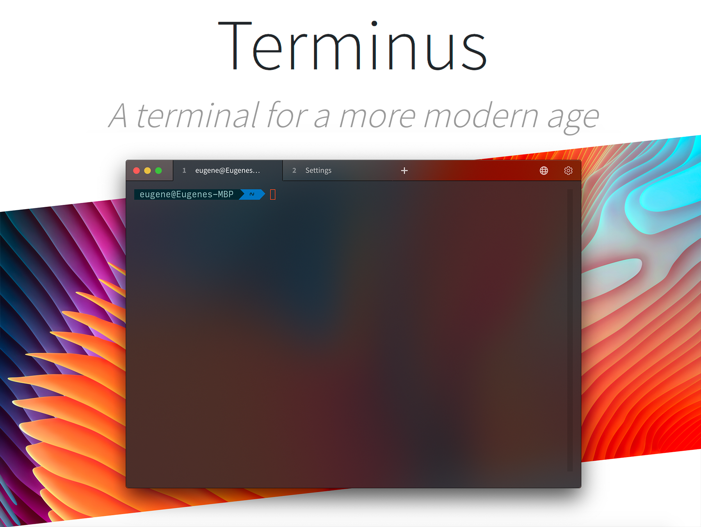

   &nbsp;  &nbsp;  &nbsp  &nbsp; 

  

----

### 下载

* [Latest release](https://github.com/Eugeny/tabby/releases/latest)
* [Repositories](https://packagecloud.io/eugeny/tabby): [Debian/Ubuntu-based](https://packagecloud.io/eugeny/tabby/install#bash-deb), [RPM-based](https://packagecloud.io/eugeny/tabby/install#bash-rpm)
* [Latest nightly build](https://nightly.link/Eugeny/tabby/workflows/build/master)

 

本 README 还适用于以下语言: <a  href="./README.md">:gb: English</a> · <a  href="./README.es-ES.md">:es: Spanish</a> · <a  href="./README.ru-RU.md">:ru: Русский</a> · <a  href="./README.ko-KR.md">:kr: 한국어</a> · <a  href="./README.it-IT.md">:it: Italiano</a> · <a href="./README.de-DE.md">:de: Deutsch</a> · <a href="./README.ja-JP.md">:jp: 日本語</a> · <a href="./README.id-ID.md">:id: Bahasa Indonesia</a> · <a href="./README.pt-BR.md">:brazil: Português</a> · <a href="./README.pl-PL.md">:poland: Polski</a>

----

[**Tabby**](https://tabby.sh) (前身是 **Terminus**) 是一个可高度配置的终端模拟器和 SSH 或串口客户端，支持 Windows，macOS 和 Linux

* 集成 SSH，Telnet 客户端和连接管理器
* 集成串行终端
* 定制主题和配色方案
* 完全可配置的快捷键和多键快捷键
* 分体式窗格
* 自动保存标签页
* 支持 PowerShell（和 PS Core）、WSL、Git-Bash、Cygwin、MSYS2、Cmder 和 CMD
* 在 SSH 会话中通过 Zmodem 进行直接文件传输
* 完整的 Unicode 支持，包括双角字符
* 不会因快速的输出而卡住
* Windows 上舒适的 shell 体验，包括 tab 自动补全（通过 Clink）
* 为 SSH secrets 和设置集成了加密容器
* SSH、SFTP 和 Telnet 客户端可用作 [Web 应用](https://tabby.sh/app)（也可[托管](https://github.com/Eugeny/tabby-web)）

# 目录 <!-- omit in toc -->

- [Tabby是什么](#tabby是什么)
- [终端特性](#终端特性)
- [SSH 客户端](#ssh-客户端)
- [串行终端](#串行终端)
- [便携式应用](#便携式应用)
- [插件](#插件)
- [主题](#主题)
- [贡献](#贡献)

# Tabby是什么

* **Tabby 是** Windows 标准终端 (conhost)、PowerShell ISE、PuTTY、macOS Terminal.app 和 iTerm 的替代品

* **Tabby 不是**一个全新的 shell，也不是 MinGW 或 Cygwin 的替代品。它也不是轻量级的 - 如果你对内存的占用很敏感，请考虑 [Conemu](https://conemu.github.io) 或 [Alacritty](https://github.com/jwilm/alacritty)

# 终端特性

* 一个 VT220 终端 + 各种插件
* 多个嵌套的拆分窗格
* 可以将标签页设置在窗口的任意一侧
* 带有全局生成热键的可选可停靠窗口（“Quake console”）
* 进度检测
* 流程完成通知
* 带括号的粘贴，多行粘贴提示
* 连体字
* 自定义 shell 配置文件
* 可选的 RMB 粘贴和复制选择（PuTTY 风格）

# SSH 客户端

* 带有连接管理器的 SSH2 客户端
* X11和端口转发
* 自动跳转主机管理
* 代理转发（包括 Pageant 和 Windows 原生 OpenSSH 代理）
* 登录脚本

# 串行终端

* 保存连接
* 逐行读取的输入支持
* 可选的十六进制逐字节输入和十六进制转储输出
* 换行转换
* 自动重连

# 便携式应用

如果在 Tabby.exe 所在的目录创建一个名为`data`文件夹，Tabby 将可以在 Windows 上作为便携式的应用程序运行。

# 插件

插件和主题可以直接在 Tabby 设置中安装。

* [clickable-links](https://github.com/Eugeny/tabby-clickable-links) - 使终端中的路径和 URL 可点击
* [docker](https://github.com/Eugeny/tabby-docker) - 连接 Docker 容器
* [title-control](https://github.com/kbjr/terminus-title-control) - 允许通过提供要删除的前缀、后缀和/或字符串来修改标签页的标题
* [quick-cmds](https://github.com/Domain/terminus-quick-cmds) - 快速向一个或所有标签页发送命令
* [save-output](https://github.com/Eugeny/tabby-save-output) - 将终端输出记录到文件中
* [sync-config](https://github.com/starxg/terminus-sync-config) - 将配置同步到 Gist 或 Gitee
* [clippy](https://github.com/Eugeny/tabby-clippy) - 一个可以一直烦你的示例插件
* [workspace-manager](https://github.com/composer404/tabby-workspace-manager) - 允许根据给定的配置创建自定义工作区配置文件
* [search-in-browser](https://github.com/composer404/tabby-search-in-browser) - 从 Tabby 标签页带有选中的文本来打开系统默认浏览器
* [sftp-tab](https://github.com/wljince007/tabby-sftp-tab) - 为ssh连接打开类似SecureCRT的sftp标签页

# 主题

* [hype](https://github.com/Eugeny/tabby-theme-hype) - 受 Hyper 启发的主题
* [relaxed](https://github.com/Relaxed-Theme/relaxed-terminal-themes#terminus) - 为 Tabby 打造的 Relaxed 主题
* [gruvbox](https://github.com/porkloin/terminus-theme-gruvbox)
* [windows10](https://www.npmjs.com/package/terminus-theme-windows10)
* [altair](https://github.com/yxuko/terminus-altair)

# Sponsors <!-- omit in toc -->

[**packagecloud**](https://packagecloud.io) 提供了免费的 Debian/RPM 存储库托管

# 贡献

欢迎提交 PR 和插件！

请参阅 [HACKING.md](https://github.com/Eugeny/tabby/blob/master/HACKING.md) 和 [API 文档](https://docs.tabby.sh/) 以获取有关项目布局的信息以及非常简短的插件开发教程。

---

感谢这些人，他们棒极了！([emoji key](https://allcontributors.org/docs/en/emoji-key)):

<!-- ALL-CONTRIBUTORS-LIST:START - Do not remove or modify this section -->
<!-- prettier-ignore-start -->
<!-- markdownlint-disable -->
<table>
  <tbody>
    <tr>
      <td align="center" valign="top" width="14.28%"><a href="http://www.russellmyers.com"> <b>Russell Myers</b></a> <a href="https://github.com/Eugeny/tabby/commits?author=mezner" title="Code">💻</a></td>
      <td align="center" valign="top" width="14.28%"><a href="http://www.morwire.com"> <b>Austin Warren</b></a> <a href="https://github.com/Eugeny/tabby/commits?author=ehwarren" title="Code">💻</a></td>
      <td align="center" valign="top" width="14.28%"><a href="https://github.com/Drachenkaetzchen"> <b>Felicia Hummel</b></a> <a href="https://github.com/Eugeny/tabby/commits?author=Drachenkaetzchen" title="Code">💻</a></td>
      <td align="center" valign="top" width="14.28%"><a href="https://github.com/mikemaccana"> <b>Mike MacCana</b></a> <a href="https://github.com/Eugeny/tabby/commits?author=mikemaccana" title="Tests">⚠️</a> <a href="#design-mikemaccana" title="Design">🎨</a></td>
      <td align="center" valign="top" width="14.28%"><a href="https://github.com/yxuko"> <b>Yacine Kanzari</b></a> <a href="https://github.com/Eugeny/tabby/commits?author=yxuko" title="Code">💻</a></td>
      <td align="center" valign="top" width="14.28%"><a href="https://github.com/BBJip"> <b>BBJip</b></a> <a href="https://github.com/Eugeny/tabby/commits?author=BBJip" title="Code">💻</a></td>
      <td align="center" valign="top" width="14.28%"><a href="https://github.com/Futagirl"> <b>Futagirl</b></a> <a href="#design-Futagirl" title="Design">🎨</a></td>
    </tr>
    <tr>
      <td align="center" valign="top" width="14.28%"><a href="https://www.levrik.io"> <b>Levin Rickert</b></a> <a href="https://github.com/Eugeny/tabby/commits?author=levrik" title="Code">💻</a></td>
      <td align="center" valign="top" width="14.28%"><a href="https://kwonoj.github.io"> <b>OJ Kwon</b></a> <a href="https://github.com/Eugeny/tabby/commits?author=kwonoj" title="Code">💻</a></td>
      <td align="center" valign="top" width="14.28%"><a href="https://github.com/Domain"> <b>domain</b></a> <a href="#plugin-Domain" title="Plugin/utility libraries">🔌</a> <a href="https://github.com/Eugeny/tabby/commits?author=Domain" title="Code">💻</a></td>
      <td align="center" valign="top" width="14.28%"><a href="http://www.jbrumond.me"> <b>James Brumond</b></a> <a href="#plugin-kbjr" title="Plugin/utility libraries">🔌</a></td>
      <td align="center" valign="top" width="14.28%"><a href="http://www.growingwiththeweb.com"> <b>Daniel Imms</b></a> <a href="https://github.com/Eugeny/tabby/commits?author=Tyriar" title="Code">💻</a> <a href="#plugin-Tyriar" title="Plugin/utility libraries">🔌</a> <a href="https://github.com/Eugeny/tabby/commits?author=Tyriar" title="Tests">⚠️</a></td>
      <td align="center" valign="top" width="14.28%"><a href="https://github.com/baflo"> <b>Florian Bachmann</b></a> <a href="https://github.com/Eugeny/tabby/commits?author=baflo" title="Code">💻</a></td>
      <td align="center" valign="top" width="14.28%"><a href="http://michael-kuehnel.de"> <b>Michael Kühnel</b></a> <a href="https://github.com/Eugeny/tabby/commits?author=mischah" title="Code">💻</a> <a href="#design-mischah" title="Design">🎨</a></td>
    </tr>
    <tr>
      <td align="center" valign="top" width="14.28%"><a href="https://github.com/NieLeben"> <b>Tilmann Meyer</b></a> <a href="https://github.com/Eugeny/tabby/commits?author=NieLeben" title="Code">💻</a></td>
      <td align="center" valign="top" width="14.28%"><a href="http://www.jubeat.net"> <b>PM Extra</b></a> <a href="https://github.com/Eugeny/tabby/issues?q=author%3APMExtra" title="Bug reports">🐛</a></td>
      <td align="center" valign="top" width="14.28%"><a href="https://jjuhas.keybase.pub//"> <b>Jonathan</b></a> <a href="https://github.com/Eugeny/tabby/commits?author=IgnusG" title="Code">💻</a></td>
      <td align="center" valign="top" width="14.28%"><a href="https://hans-koch.me"> <b>Hans Koch</b></a> <a href="https://github.com/Eugeny/tabby/commits?author=hammster" title="Code">💻</a></td>
      <td align="center" valign="top" width="14.28%"><a href="http://thepuzzlemaker.info"> <b>Dak Smyth</b></a> <a href="https://github.com/Eugeny/tabby/commits?author=ThePuzzlemaker" title="Code">💻</a></td>
      <td align="center" valign="top" width="14.28%"><a href="http://yfwz100.github.io"> <b>Wang Zhi</b></a> <a href="https://github.com/Eugeny/tabby/commits?author=yfwz100" title="Code">💻</a></td>
      <td align="center" valign="top" width="14.28%"><a href="https://github.com/jack1142"> <b>jack1142</b></a> <a href="https://github.com/Eugeny/tabby/commits?author=jack1142" title="Code">💻</a></td>
    </tr>
    <tr>
      <td align="center" valign="top" width="14.28%"><a href="https://github.com/hdougie"> <b>Howie Douglas</b></a> <a href="https://github.com/Eugeny/tabby/commits?author=hdougie" title="Code">💻</a></td>
      <td align="center" valign="top" width="14.28%"><a href="https://chriskaczor.com"> <b>Chris Kaczor</b></a> <a href="https://github.com/Eugeny/tabby/commits?author=ckaczor" title="Code">💻</a></td>
      <td align="center" valign="top" width="14.28%"><a href="https://www.boxmein.net"> <b>Johannes Kadak</b></a> <a href="https://github.com/Eugeny/tabby/commits?author=boxmein" title="Code">💻</a></td>
      <td align="center" valign="top" width="14.28%"><a href="https://github.com/LeSeulArtichaut"> <b>LeSeulArtichaut</b></a> <a href="https://github.com/Eugeny/tabby/commits?author=LeSeulArtichaut" title="Code">💻</a></td>
      <td align="center" valign="top" width="14.28%"><a href="https://github.com/CyrilTaylor"> <b>Cyril Taylor</b></a> <a href="https://github.com/Eugeny/tabby/commits?author=CyrilTaylor" title="Code">💻</a></td>
      <td align="center" valign="top" width="14.28%"><a href="https://github.com/nstefanou"> <b>nstefanou</b></a> <a href="https://github.com/Eugeny/tabby/commits?author=nstefanou" title="Code">💻</a> <a href="#plugin-nstefanou" title="Plugin/utility libraries">🔌</a></td>
      <td align="center" valign="top" width="14.28%"><a href="https://github.com/orin220444"> <b>orin220444</b></a> <a href="https://github.com/Eugeny/tabby/commits?author=orin220444" title="Code">💻</a></td>
    </tr>
    <tr>
      <td align="center" valign="top" width="14.28%"><a href="https://github.com/Goobles"> <b>Gobius Dolhain</b></a> <a href="https://github.com/Eugeny/tabby/commits?author=Goobles" title="Code">💻</a></td>
      <td align="center" valign="top" width="14.28%"><a href="https://github.com/3l0w"> <b>Gwilherm Folliot</b></a> <a href="https://github.com/Eugeny/tabby/commits?author=3l0w" title="Code">💻</a></td>
      <td align="center" valign="top" width="14.28%"><a href="https://github.com/Dimitory"> <b>Dmitry Pronin</b></a> <a href="https://github.com/Eugeny/tabby/commits?author=dimitory" title="Code">💻</a></td>
      <td align="center" valign="top" width="14.28%"><a href="https://github.com/JonathanBeverley"> <b>Jonathan Beverley</b></a> <a href="https://github.com/Eugeny/tabby/commits?author=JonathanBeverley" title="Code">💻</a></td>
      <td align="center" valign="top" width="14.28%"><a href="https://github.com/zend"> <b>Zenghai Liang</b></a> <a href="https://github.com/Eugeny/tabby/commits?author=zend" title="Code">💻</a></td>
      <td align="center" valign="top" width="14.28%"><a href="https://about.me/matishadow"> <b>Mateusz Tracz</b></a> <a href="https://github.com/Eugeny/tabby/commits?author=matishadow" title="Code">💻</a></td>
      <td align="center" valign="top" width="14.28%"><a href="https://zergpool.com"> <b>pinpin</b></a> <a href="https://github.com/Eugeny/tabby/commits?author=pinpins" title="Code">💻</a></td>
    </tr>
    <tr>
      <td align="center" valign="top" width="14.28%"><a href="https://github.com/TakuroOnoda"> <b>Takuro Onoda</b></a> <a href="https://github.com/Eugeny/tabby/commits?author=TakuroOnoda" title="Code">💻</a></td>
      <td align="center" valign="top" width="14.28%"><a href="https://github.com/frauhottelmann"> <b>frauhottelmann</b></a> <a href="https://github.com/Eugeny/tabby/commits?author=frauhottelmann" title="Code">💻</a></td>
      <td align="center" valign="top" width="14.28%"><a href="http://patalong.pl"> <b>Piotr Patalong</b></a> <a href="#design-VectorKappa" title="Design">🎨</a></td>
      <td align="center" valign="top" width="14.28%"><a href="https://github.com/clarkwang"> <b>Clark Wang</b></a> <a href="https://github.com/Eugeny/tabby/commits?author=clarkwang" title="Code">💻</a></td>
      <td align="center" valign="top" width="14.28%"><a href="https://github.com/iamchating"> <b>iamchating</b></a> <a href="https://github.com/Eugeny/tabby/commits?author=iamchating" title="Code">💻</a></td>
      <td align="center" valign="top" width="14.28%"><a href="https://github.com/starxg"> <b>starxg</b></a> <a href="#plugin-starxg" title="Plugin/utility libraries">🔌</a></td>
      <td align="center" valign="top" width="14.28%"><a href="http://hashnote.net/"> <b>Alisue</b></a> <a href="#design-lambdalisue" title="Design">🎨</a></td>
    </tr>
    <tr>
      <td align="center" valign="top" width="14.28%"><a href="https://github.com/ydcool"> <b>Dominic Yin</b></a> <a href="https://github.com/Eugeny/tabby/commits?author=ydcool" title="Code">💻</a></td>
      <td align="center" valign="top" width="14.28%"><a href="https://github.com/bdr99"> <b>Brandon Rothweiler</b></a> <a href="#design-bdr99" title="Design">🎨</a></td>
      <td align="center" valign="top" width="14.28%"><a href="https://git.io/JnP49"> <b>Logic Machine</b></a> <a href="https://github.com/Eugeny/tabby/commits?author=logicmachine123" title="Documentation">📖</a></td>
      <td align="center" valign="top" width="14.28%"><a href="https://github.com/cypherbits"> <b>cypherbits</b></a> <a href="https://github.com/Eugeny/tabby/commits?author=cypherbits" title="Documentation">📖</a></td>
      <td align="center" valign="top" width="14.28%"><a href="https://modulolotus.net"> <b>Matthew Davidson</b></a> <a href="https://github.com/Eugeny/tabby/commits?author=KingMob" title="Code">💻</a></td>
      <td align="center" valign="top" width="14.28%"><a href="https://github.com/al-wi"> <b>Alexander Wiedemann</b></a> <a href="https://github.com/Eugeny/tabby/commits?author=al-wi" title="Code">💻</a></td>
      <td align="center" valign="top" width="14.28%"><a href="https://www.notion.so/3d45c6bd2cbd4f938873a4bd12e23375"> <b>장보연</b></a> <a href="https://github.com/Eugeny/tabby/commits?author=BoYeonJang" title="Documentation">📖</a></td>
    </tr>
    <tr>
      <td align="center" valign="top" width="14.28%"><a href="https://github.com/Me1onRind"> <b>zZ</b></a> <a href="https://github.com/Eugeny/tabby/commits?author=Me1onRind" title="Code">💻</a></td>
      <td align="center" valign="top" width="14.28%"><a href="https://github.com/tainoNZ"> <b>Aaron Davison</b></a> <a href="https://github.com/Eugeny/tabby/commits?author=tainoNZ" title="Code">💻</a></td>
      <td align="center" valign="top" width="14.28%"><a href="https://github.com/composer404"> <b>Przemyslaw Kozik</b></a> <a href="#design-composer404" title="Design">🎨</a></td>
      <td align="center" valign="top" width="14.28%"><a href="https://github.com/highfredo"> <b>Alfredo Arellano de la Fuente</b></a> <a href="https://github.com/Eugeny/tabby/commits?author=highfredo" title="Code">💻</a></td>
      <td align="center" valign="top" width="14.28%"><a href="https://github.com/NessunKim"> <b>MH Kim</b></a> <a href="https://github.com/Eugeny/tabby/commits?author=NessunKim" title="Code">💻</a></td>
      <td align="center" valign="top" width="14.28%"><a href="https://discord.gg/4c5EVTBhtp"> <b>Marmota</b></a> <a href="#design-jaimeadf" title="Design">🎨</a></td>
      <td align="center" valign="top" width="14.28%"><a href="https://ares.zone"> <b>Ares Andrew</b></a> <a href="https://github.com/Eugeny/tabby/commits?author=TENX-S" title="Documentation">📖</a></td>
    </tr>
    <tr>
      <td align="center" valign="top" width="14.28%"><a href="https://usual.io/"> <b>George Korsnick</b></a> <a href="#financial-gkor" title="Financial">💵</a></td>
      <td align="center" valign="top" width="14.28%"><a href="https://about.me/ulu"> <b>Artem Smirnov</b></a> <a href="#financial-uluhonolulu" title="Financial">💵</a></td>
      <td align="center" valign="top" width="14.28%"><a href="https://github.com/nevotheless"> <b>Tim Kopplow</b></a> <a href="#financial-nevotheless" title="Financial">💵</a></td>
      <td align="center" valign="top" width="14.28%"><a href="https://github.com/mrthock"> <b>mrthock</b></a> <a href="#financial-mrthock" title="Financial">💵</a></td>
      <td align="center" valign="top" width="14.28%"><a href="https://github.com/lrottach"> <b>Lukas Rottach</b></a> <a href="#financial-lrottach" title="Financial">💵</a></td>
      <td align="center" valign="top" width="14.28%"><a href="https://github.com/boonkerz"> <b>boonkerz</b></a> <a href="https://github.com/Eugeny/tabby/commits?author=boonkerz" title="Code">💻</a> <a href="#translation-boonkerz" title="Translation">🌍</a></td>
      <td align="center" valign="top" width="14.28%"><a href="https://github.com/milotype"> <b>Milo Ivir</b></a> <a href="#translation-milotype" title="Translation">🌍</a></td>
    </tr>
    <tr>
      <td align="center" valign="top" width="14.28%"><a href="https://github.com/JasonCubic"> <b>JasonCubic</b></a> <a href="#design-JasonCubic" title="Design">🎨</a></td>
      <td align="center" valign="top" width="14.28%"><a href="https://github.com/MaxWaldorf"> <b>MaxWaldorf</b></a> <a href="#infra-MaxWaldorf" title="Infrastructure (Hosting, Build-Tools, etc)">🚇</a></td>
      <td align="center" valign="top" width="14.28%"><a href="https://github.com/mwz"> <b>Michael Wizner</b></a> <a href="https://github.com/Eugeny/tabby/commits?author=mwz" title="Code">💻</a></td>
      <td align="center" valign="top" width="14.28%"><a href="https://github.com/mgrulich"> <b>Martin</b></a> <a href="https://github.com/Eugeny/tabby/commits?author=mgrulich" title="Code">💻</a></td>
      <td align="center" valign="top" width="14.28%"><a href="https://github.com/piersandro"> <b>Piersandro Guerrera</b></a> <a href="https://github.com/Eugeny/tabby/commits?author=piersandro" title="Documentation">📖</a> <a href="#translation-piersandro" title="Translation">🌍</a></td>
      <td align="center" valign="top" width="14.28%"><a href="https://github.com/0x973"> <b>0x973</b></a> <a href="https://github.com/Eugeny/tabby/commits?author=0x973" title="Code">💻</a></td>
      <td align="center" valign="top" width="14.28%"><a href="https://github.com/Allenator"> <b>Allenator</b></a> <a href="https://github.com/Eugeny/tabby/commits?author=Allenator" title="Documentation">📖</a></td>
    </tr>
    <tr>
      <td align="center" valign="top" width="14.28%"><a href="http://microhobby.com.br/blog"> <b>Matheus Castello</b></a> <a href="https://github.com/Eugeny/tabby/commits?author=microhobby" title="Code">💻</a></td>
      <td align="center" valign="top" width="14.28%"><a href="https://github.com/Jai-JAP"> <b>Jai A P</b></a> <a href="#platform-Jai-JAP" title="Packaging/porting to new platform">📦</a></td>
      <td align="center" valign="top" width="14.28%"><a href="https://blog.ysc3839.com"> <b>Richard Yu</b></a> <a href="https://github.com/Eugeny/tabby/commits?author=ysc3839" title="Code">💻</a></td>
      <td align="center" valign="top" width="14.28%"><a href="https://github.com/artu-ole"> <b>artu-ole</b></a> <a href="https://github.com/Eugeny/tabby/commits?author=artu-ole" title="Code">💻</a></td>
      <td align="center" valign="top" width="14.28%"><a href="https://timagribanov.github.io/"> <b>Timofey Gribanov</b></a> <a href="https://github.com/Eugeny/tabby/commits?author=TimaGribanov" title="Documentation">📖</a> <a href="#translation-TimaGribanov" title="Translation">🌍</a></td>
      <td align="center" valign="top" width="14.28%"><a href="https://git.christianbingman.com"> <b>Christian Bingman</b></a> <a href="https://github.com/Eugeny/tabby/commits?author=ChristianBingman" title="Code">💻</a></td>
      <td align="center" valign="top" width="14.28%"><a href="http://zhangzhipeng2023.cn/"> <b>zhipeng</b></a> <a href="https://github.com/Eugeny/tabby/commits?author=Ox0400" title="Code">💻</a></td>
    </tr>
    <tr>
      <td align="center" valign="top" width="14.28%"><a href="https://github.com/woodmeal"> <b>woodmeal</b></a> <a href="https://github.com/Eugeny/tabby/commits?author=woodmeal" title="Code">💻</a></td>
      <td align="center" valign="top" width="14.28%"><a href="https://magiclike.codeberg.page/"> <b>MagicLike</b></a> <a href="https://github.com/Eugeny/tabby/commits?author=MagicLike" title="Documentation">📖</a></td>
      <td align="center" valign="top" width="14.28%"><a href="https://github.com/hisamafahri"> <b>Hisam Fahri</b></a> <a href="https://github.com/Eugeny/tabby/commits?author=hisamafahri" title="Code">💻</a></td>
      <td align="center" valign="top" width="14.28%"><a href="https://liangchengj.com"> <b>Liangcheng Juves</b></a> <a href="https://github.com/Eugeny/tabby/commits?author=LiangchengJ" title="Code">💻</a></td>
      <td align="center" valign="top" width="14.28%"><a href="https://github.com/attet"> <b>Atte Timonen</b></a> <a href="https://github.com/Eugeny/tabby/commits?author=attet" title="Code">💻</a></td>
      <td align="center" valign="top" width="14.28%"><a href="https://www.linkedin.com/in/joaolmpinto/"> <b>João Pinto</b></a> <a href="https://github.com/Eugeny/tabby/commits?author=joaompinto" title="Documentation">📖</a></td>
      <td align="center" valign="top" width="14.28%"><a href="https://github.com/Qiming-Liu"> <b>Alan</b></a> <a href="https://github.com/Eugeny/tabby/commits?author=Qiming-Liu" title="Code">💻</a></td>
    </tr>
    <tr>
      <td align="center" valign="top" width="14.28%"><a href="https://74th.tech/"> <b>Atsushi Morimoto</b></a> <a href="#financial-74th" title="Financial">💵</a></td>
      <td align="center" valign="top" width="14.28%"><a href="https://arles.red/"> <b>Arles</b></a> <a href="#financial-aarles" title="Financial">💵</a></td>
      <td align="center" valign="top" width="14.28%"><a href="https://pentestbook.six2dez.com/"> <b>six2dez</b></a> <a href="#financial-six2dez" title="Financial">💵</a></td>
      <td align="center" valign="top" width="14.28%"><a href="https://github.com/CandiceJoy"> <b>Candice</b></a> <a href="#financial-CandiceJoy" title="Financial">💵</a></td>
      <td align="center" valign="top" width="14.28%"><a href="https://github.com/kingrowen"> <b>Rowen Willabus</b></a> <a href="#financial-kingrowen" title="Financial">💵</a></td>
      <td align="center" valign="top" width="14.28%"><a href="https://hengy1.top/"> <b>HengY1Coding✨</b></a> <a href="#financial-HengY1Sky" title="Financial">💵</a></td>
      <td align="center" valign="top" width="14.28%"><a href="https://github.com/FrancisHG"> <b>Francis Gelderloos</b></a> <a href="#financial-FrancisHG" title="Financial">💵</a></td>
    </tr>
    <tr>
      <td align="center" valign="top" width="14.28%"><a href="https://github.com/astromasoud"> <b>astromasoud</b></a> <a href="#financial-astromasoud" title="Financial">💵</a></td>
      <td align="center" valign="top" width="14.28%"><a href="https://spirit55555.dk/"> <b>Anders G. Jørgensen</b></a> <a href="#financial-Spirit55555" title="Financial">💵</a></td>
      <td align="center" valign="top" width="14.28%"><a href="https://github.com/djradon"> <b>Dave Richardson</b></a> <a href="#financial-djradon" title="Financial">💵</a></td>
      <td align="center" valign="top" width="14.28%"><a href="https://twitter.com/tpberntsen"> <b>Thomas Peter Berntsen</b></a> <a href="#financial-tpberntsen" title="Financial">💵</a></td>
      <td align="center" valign="top" width="14.28%"><a href="https://bandism.net/"> <b>Ikko Ashimine</b></a> <a href="https://github.com/Eugeny/tabby/commits?author=eltociear" title="Documentation">📖</a></td>
      <td align="center" valign="top" width="14.28%"><a href="https://github.com/giejqf"> <b>giejqf</b></a> <a href="https://github.com/Eugeny/tabby/commits?author=giejqf" title="Code">💻</a></td>
      <td align="center" valign="top" width="14.28%"><a href="https://github.com/LacazeThomas"> <b>Thomas LACAZE</b></a> <a href="https://github.com/Eugeny/tabby/commits?author=LacazeThomas" title="Code">💻</a></td>
    </tr>
    <tr>
      <td align="center" valign="top" width="14.28%"><a href="https://pochen.me/"> <b>Po Chen</b></a> <a href="#financial-princemaple" title="Financial">💵</a></td>
      <td align="center" valign="top" width="14.28%"><a href="https://victorchandra.carrd.co/"> <b>Victor Chandra</b></a> <a href="https://github.com/Eugeny/tabby/commits?author=mzmznasipadang" title="Documentation">📖</a></td>
      <td align="center" valign="top" width="14.28%"><a href="https://github.com/daniel347x"> <b>Dan Nissenbaum</b></a> <a href="#financial-daniel347x" title="Financial">💵</a></td>
      <td align="center" valign="top" width="14.28%"><a href="https://github.com/DunklerPhoenix"> <b>RogueThorn</b></a> <a href="#financial-DunklerPhoenix" title="Financial">💵</a></td>
      <td align="center" valign="top" width="14.28%"><a href="http://spenserblack.github.io"> <b>Spenser Black</b></a> <a href="https://github.com/Eugeny/tabby/commits?author=spenserblack" title="Code">💻</a></td>
      <td align="center" valign="top" width="14.28%"><a href="https://github.com/zuedev"> <b>Alex</b></a> <a href="#financial-zuedev" title="Financial">💵</a></td>
      <td align="center" valign="top" width="14.28%"><a href="https://hengy1.top/"> <b>HengY1Coding✨</b></a> <a href="#financial-HengY1Cola" title="Financial">💵</a></td>
    </tr>
    <tr>
      <td align="center" valign="top" width="14.28%"><a href="https://www.stackscale.com/"> <b>David Carrero</b></a> <a href="https://github.com/Eugeny/tabby/commits?author=dcarrero" title="Documentation">📖</a></td>
      <td align="center" valign="top" width="14.28%"><a href="https://github.com/zhoro"> <b>Andrii Zhovtiak</b></a> <a href="https://github.com/Eugeny/tabby/commits?author=zhoro" title="Code">💻</a></td>
      <td align="center" valign="top" width="14.28%"><a href="https://github.com/JohnMasoner"> <b>Mason Ma</b></a> <a href="#financial-JohnMasoner" title="Financial">💵</a></td>
      <td align="center" valign="top" width="14.28%"><a href="https://github.com/ntimo"> <b>Timo</b></a> <a href="#financial-ntimo" title="Financial">💵</a></td>
      <td align="center" valign="top" width="14.28%"><a href="https://www.linkedin.com/in/evinwatson/"> <b>Evin Watson</b></a> <a href="https://github.com/Eugeny/tabby/commits?author=EvinRWatson" title="Documentation">📖</a></td>
      <td align="center" valign="top" width="14.28%"><a href="https://t.me/hendrjl"> <b>Hendra Juli</b></a> <a href="https://github.com/Eugeny/tabby/commits?author=deulizealand" title="Documentation">📖</a></td>
      <td align="center" valign="top" width="14.28%"><a href="https://github.com/wkricowski"> <b>Wellinton Kricowski</b></a> <a href="#financial-wkricowski" title="Financial">💵</a> <a href="https://github.com/Eugeny/tabby/commits?author=wkricowski" title="Documentation">📖</a></td>
    </tr>
    <tr>
      <td align="center" valign="top" width="14.28%"><a href="https://github.com/almzau"> <b>Allan</b></a> <a href="#design-almzau" title="Design">🎨</a></td>
      <td align="center" valign="top" width="14.28%"><a href="https://oidamo.de"> <b>Benjamin Brandmeier</b></a> <a href="https://github.com/Eugeny/tabby/commits?author=BenjaminBrandmeier" title="Code">💻</a></td>
      <td align="center" valign="top" width="14.28%"><a href="https://github.com/patric1025"> <b>patric1025</b></a> <a href="#translation-patric1025" title="Translation">🌍</a></td>
      <td align="center" valign="top" width="14.28%"><a href="https://github.com/hermitpopcorn"> <b>hermitpopcorn</b></a> <a href="https://github.com/Eugeny/tabby/commits?author=hermitpopcorn" title="Code">💻</a></td>
      <td align="center" valign="top" width="14.28%"><a href="https://joshuatz.com/"> <b>Joshua Tzucker</b></a> <a href="#financial-joshuatz" title="Financial">💵</a></td>
      <td align="center" valign="top" width="14.28%"><a href="https://github.com/luxifr"> <b>luxifr</b></a> <a href="#financial-luxifr" title="Financial">💵</a></td>
      <td align="center" valign="top" width="14.28%"><a href="https://github.com/ukulanne"> <b>Anne Summers</b></a> <a href="#financial-ukulanne" title="Financial">💵</a></td>
    </tr>
    <tr>
      <td align="center" valign="top" width="14.28%"><a href="https://github.com/Clem-Fern"> <b>Clem</b></a> <a href="https://github.com/Eugeny/tabby/commits?author=Clem-Fern" title="Code">💻</a></td>
      <td align="center" valign="top" width="14.28%"><a href="https://github.com/elizabeth-dev"> <b>Elizabeth Martín Campos</b></a> <a href="https://github.com/Eugeny/tabby/commits?author=elizabeth-dev" title="Code">💻</a></td>
      <td align="center" valign="top" width="14.28%"><a href="https://github.com/siccous"> <b>Tomáš Hruška</b></a> <a href="https://github.com/Eugeny/tabby/commits?author=siccous" title="Code">💻</a></td>
      <td align="center" valign="top" width="14.28%"><a href="https://github.com/karaketir16"> <b>Osman Karaketir</b></a> <a href="https://github.com/Eugeny/tabby/commits?author=karaketir16" title="Code">💻</a></td>
      <td align="center" valign="top" width="14.28%"><a href="https://www.gnomegarden.io/"> <b>Crypto Gnome</b></a> <a href="#financial-CryptoGnome" title="Financial">💵</a></td>
      <td align="center" valign="top" width="14.28%"><a href="https://github.com/rbukovansky"> <b>Richard Bukovansky</b></a> <a href="#financial-rbukovansky" title="Financial">💵</a></td>
      <td align="center" valign="top" width="14.28%"><a href="https://github.com/pseudocc"> <b>catlas</b></a> <a href="#financial-pseudocc" title="Financial">💵</a></td>
    </tr>
    <tr>
      <td align="center" valign="top" width="14.28%"><a href="http://kapocsi.ca"> <b>Thomas Kapocsi</b></a> <a href="https://github.com/Eugeny/tabby/commits?author=Kapocsi" title="Documentation">📖</a></td>
      <td align="center" valign="top" width="14.28%"><a href="https://dylhack.dev/"> <b>Dylan Hackworth</b></a> <a href="#financial-dylhack" title="Financial">💵</a></td>
      <td align="center" valign="top" width="14.28%"><a href="https://github.com/echo304"> <b>Sangboak Lee</b></a> <a href="https://github.com/Eugeny/tabby/commits?author=echo304" title="Code">💻</a></td>
      <td align="center" valign="top" width="14.28%"><a href="https://github.com/qyecst"> <b>qyecst</b></a> <a href="https://github.com/Eugeny/tabby/commits?author=qyecst" title="Code">💻</a></td>
      <td align="center" valign="top" width="14.28%"><a href="https://github.com/DehanLUO"> <b>Han</b></a> <a href="https://github.com/Eugeny/tabby/commits?author=DehanLUO" title="Code">💻</a></td>
      <td align="center" valign="top" width="14.28%"><a href="https://github.com/wljince007"> <b>wljince007</b></a> <a href="https://github.com/Eugeny/tabby/commits?author=wljince007" title="Code">💻</a></td>
      <td align="center" valign="top" width="14.28%"><a href="https://github.com/FeroTheFox"> <b>fero</b></a> <a href="https://github.com/Eugeny/tabby/commits?author=FeroTheFox" title="Code">💻</a></td>
    </tr>
    <tr>
      <td align="center" valign="top" width="14.28%"><a href="https://siebsie23.nl/"> <b>Sibren</b></a> <a href="https://github.com/Eugeny/tabby/commits?author=siebsie23" title="Code">💻</a></td>
      <td align="center" valign="top" width="14.28%"><a href="https://www.nathaniel-walser.com"> <b>Nathaniel Walser</b></a> <a href="https://github.com/Eugeny/tabby/commits?author=nwalser" title="Code">💻</a></td>
      <td align="center" valign="top" width="14.28%"><a href="https://github.com/aaronhuggins"> <b>Aaron Huggins</b></a> <a href="#design-aaronhuggins" title="Design">🎨</a></td>
      <td align="center" valign="top" width="14.28%"><a href="https://zkxdex.github.io/"> <b>KDex</b></a> <a href="https://github.com/Eugeny/tabby/commits?author=zKXDEX" title="Code">💻</a></td>
      <td align="center" valign="top" width="14.28%"><a href="https://github.com/kimbob13"> <b>ChangHwan Kim</b></a> <a href="https://github.com/Eugeny/tabby/commits?author=kimbob13" title="Code">💻</a></td>
      <td align="center" valign="top" width="14.28%"><a href="https://github.com/ashneilson"> <b>Ash Neilson</b></a> <a href="https://github.com/Eugeny/tabby/commits?author=ashneilson" title="Code">💻</a></td>
      <td align="center" valign="top" width="14.28%"><a href="https://github.com/cfs4819"> <b>Chen Fansong</b></a> <a href="https://github.com/Eugeny/tabby/commits?author=cfs4819" title="Code">💻</a></td>
    </tr>
    <tr>
      <td align="center" valign="top" width="14.28%"><a href="https://5k.work/"> <b>Mxmilu</b></a> <a href="https://github.com/Eugeny/tabby/commits?author=Mxmilu666" title="Code">💻</a></td>
      <td align="center" valign="top" width="14.28%"><a href="https://cbuff.dev"> <b>Charles Buffington</b></a> <a href="https://github.com/Eugeny/tabby/commits?author=C41M50N" title="Code">💻</a></td>
      <td align="center" valign="top" width="14.28%"><a href="https://github.com/GeminiLn"> <b>Yu Qin</b></a> <a href="https://github.com/Eugeny/tabby/commits?author=GeminiLn" title="Code">💻</a></td>
      <td align="center" valign="top" width="14.28%"><a href="https://github.com/fireblue"> <b>fireblue</b></a> <a href="https://github.com/Eugeny/tabby/commits?author=fireblue" title="Code">💻</a></td>
      <td align="center" valign="top" width="14.28%"><a href="https://github.com/marko1616"> <b>marko1616</b></a> <a href="https://github.com/Eugeny/tabby/commits?author=marko1616" title="Code">💻</a></td>
      <td align="center" valign="top" width="14.28%"><a href="https://www.selfhosted.sg/"> <b>SelfHosted</b></a> <a href="#financial-SelfHosted-Club" title="Financial">💵</a></td>
      <td align="center" valign="top" width="14.28%"><a href="http://hiroga.hatenablog.com/"> <b>Hiroaki Ogasawara</b></a> <a href="https://github.com/Eugeny/tabby/commits?author=xhiroga" title="Code">💻</a></td>
    </tr>
    <tr>
      <td align="center" valign="top" width="14.28%"><a href="https://github.com/geodic"> <b>geodic</b></a> <a href="https://github.com/Eugeny/tabby/commits?author=geodic" title="Code">💻</a></td>
    </tr>
  </tbody>
</table>

<!-- markdownlint-restore -->
<!-- prettier-ignore-end -->

<!-- ALL-CONTRIBUTORS-LIST:END -->

本项目遵循 [all-contributors](https://github.com/all-contributors/all-contributors) 规范。 欢迎任何形式的贡献！
